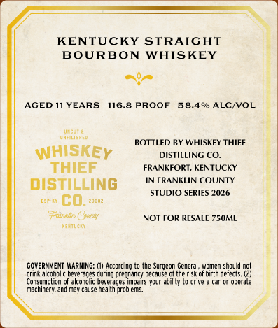
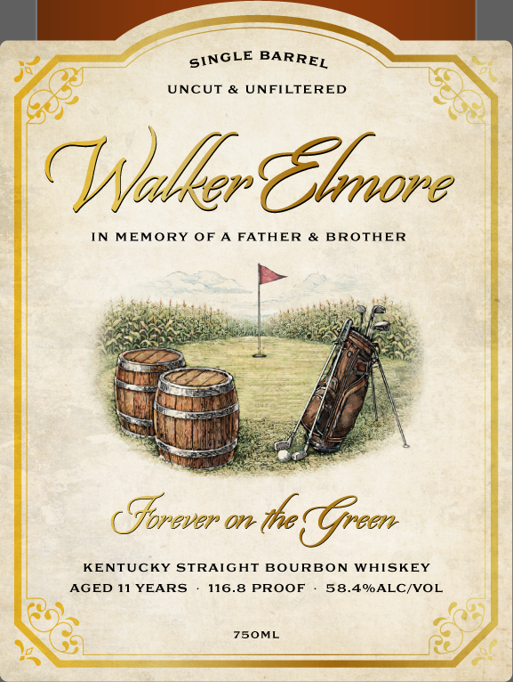

# TTB COLA Label Images - TTBID 26055001000217

**Brand Name:** WHISKEY THIEF DISTILLING CO.

**Fanciful Name:** WALKER ELMORE

**Issue Date:** 02/24/2026

**Origin Code:** 22

**Product Class/Type:** 101

**Source:** [TTB Public COLA Registry](https://ttbonline.gov/colasonline/viewColaDetails.do?action=publicFormDisplay&ttbid=26055001000217)

## Label Images

### Back Label

### Front Label

## Extracted Label Text

*Text extracted via OCR - may contain errors*

### Back Label

KENTUCKY STRAIGHT

BOURBON WHISKEY

nr

AGED 11 YEARS

116.8 PROOF 58.4% ALC/VOL

neers

wamanets

BOTTLED BY WHISKEY THIEF

WHISKEy

DISTILLING CO.

THIEF

FRANKFORT, KENTUCKY

IN FRANKLIN COUNTY

DISTILLING

STUDIO SERIES 2026,

ary CD, ewe:

nhl

ety

NOT FOR RESALE 750ML

emery

GOVERNMENT WARNING: (1) Acording to the Surgeon General, women should nt

Consumption of alcoboic beverages pars your abit o drive a car or operate

‘ink alcoholic beverages during prearancy because ofthe risk of ith defects (2),

machinery, and may case heath problems.

### Front Label

ZS

SINGLE BARRE,

a

eS

UNCUT & UNFILTERED

Nadler Chnire

IN MEMORY OF A FATHER & BROTHER

nee

bai

ks

sh

By

e

oF fea

Bean

*

/'

$5

“3

pats

ye

ee

r

te.

=

ay)

ay

Rama

os

A

van

Be,

See

PO

o

os

CSorever on (the Gren

KENTUCKY STRAIGHT BOURBON WHISKEY

AGED 11 YEARS

116.8 PROOF

58.4%ALC/VOL

pA

as)

7SOML

\

Sa

Ua

o
