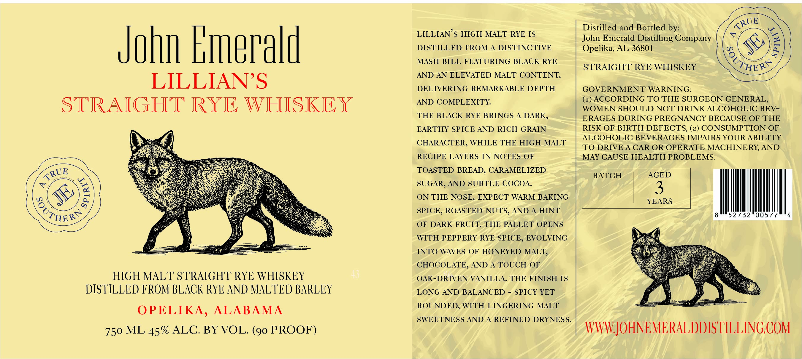

# TTB COLA Label Images - TTBID 26055001000309

**Brand Name:** JOHN EMERALD

**Fanciful Name:** LILLIAN'S STRAIGHT RYE WHISKEY

**Issue Date:** 02/25/2026

**Origin Code:** 10

**Product Class/Type:** 102

**Source:** [TTB Public COLA Registry](https://ttbonline.gov/colasonline/viewColaDetails.do?action=publicFormDisplay&ttbid=26055001000309)

## Label Images

### Label 1

## Extracted Label Text

*Text extracted via OCR - may contain errors*

**Detected Proof:** 90

### Label 1

John Emerald

LILLIAN’S
STRAIGHT RYE WHISKEY

HIGH MALT STRAIGHT RYE WHISKEY
DISTILLED FROM BLACK RYE AND MALTED BARLEY

OPELIKA, ALABAMA
750 ML 45% ALC. BY VOL. (90 PROOF)

LILLIAN ’S HIGH MALT RYE IS
DISTILLED FROM A DISTINCTIVE
MASH BILL FEATURING BLACK RYE
AND AN ELEVATED MALT CONTENT,
DELIVERING REMARKABLE DEPTH
AND COMPLEXITY.

THE BLACK RYE BRINGS A DARK,
EARTHY SPICE AND RICH GRAIN
CHARACTER, WHILE THE HIGH MALT
RECIPE LAYERS IN NOTES OF
TOASTED BREAD, CARAMELIZED
SUGAR, AND SUBTLE COCOA.

ON THE NOSE, EXPECT WARM BAKING
SPICE, ROASTED NUTS, AND A HINT
OF DARK FRUIT. THE PALLET OPENS
WITH PEPPERY RYE SPICE, EVOLVING
INTO WAVES OF HONEYED MALT,
CHOCOLATE, AND A TOUCH OF
OAK-DRIVEN VANILLA. THE FINISH IS
LONG AND BALANCED - SPICY YET
ROUNDED, WITH LINGERING MALT

SWEETNESS AND A REFINED DRYNESS.

Distilled and Bottled by:
John Emerald Distilling Company

Opelika, AL 36801

STRAIGHT RYE WHISKEY

GOVERNMENT WARNING:

(1) ACCORDING TO THE SURGEON GENERAL,
WOMEN SHOULD NOT DRINK ALCOHOLIC BEV-
ERAGES DURING PREGNANCY BECAUSE OF THE
RISK OF BIRTH DEFECTS, (2) CONSUMPTION OF
ALCOHOLIC BEVERAGES IMPAIRS YOUR ABILITY
TO DRIVE A CAR OR OPERATE MACHINERY, AND
MAY CAUSE HEALTH PROBLEMS.

BATCH

AGED

$)

YEARS

8 Ih

4

WWW.JOHNEMERALDDISTILLING.COM
