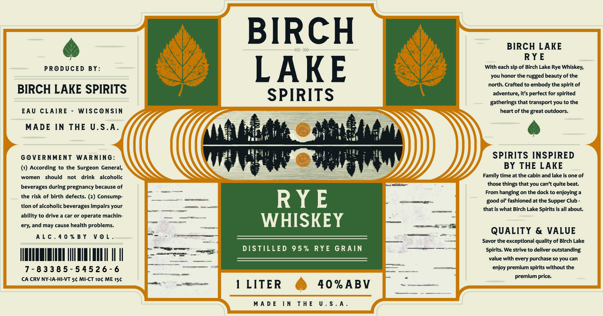

# TTB COLA Label Images - TTBID 26055001000713

**Brand Name:** BIRCH LAKE SPIRITS

**Fanciful Name:** RYE

**Issue Date:** 02/25/2026

**Origin Code:** 48

**Product Class/Type:** 142

**Source:** [TTB Public COLA Registry](https://ttbonline.gov/colasonline/viewColaDetails.do?action=publicFormDisplay&ttbid=26055001000713)

## Label Images

### Label 1

### Label 2

## Extracted Label Text

*Text extracted via OCR - may contain errors*

*1 image(s) excluded: text did not meet readability threshold*

### Label 1

&

PRODUCED BY:

BIRCH LAKE SPIRITS

EAU CLAIRE - WISCONSIN

MADE IN THE U.S.A.

GOVERNMENT WARNING:

(1) According to the Surgeon General,
women should not drink alcoholic
beverages during pregnancy because of
the risk of birth defects. (2) Consump-
tion of alcoholic beverages impairs your
ability to drive a car or operate machin-
ery, and may cause health problems.

ALC.40%BY VOL.

7-83385-54526-6
CA CRV NY-IA-HI-VT 5¢ MI-CT 10¢ ME 15¢

1 LITER

BIRCH
LAKE

SPIRITS

WHISKEY

DISTILLED 95% RYE GRAIN

MADE IN THE U.S.A.

40% ABV

BIRCH LAKE
RYE
With each sip of Birch Lake Rye Whiskey,
you honor the rugged beauty of the
north, Crafted to embody the spirit of
adventure, it's perfect for spirited
gatherings that transport you to the
heart of the great outdoors.

@

SPIRITS INSPIRED
BY THE LAKE

Family time at the cabin and lake Is one of
those things that you can’t quite beat.
From hanging on the dock to enjoying a
good o?’ fashioned at the Supper Club -
that is what Birch Lake Spirits is all about.

QUALITY & VALUE
Savor the exceptional quality of Birch Lake
Spirits. We strive to deliver outstanding,
value with every purchase so you can
enjoy premium spirits without the
premium price.
