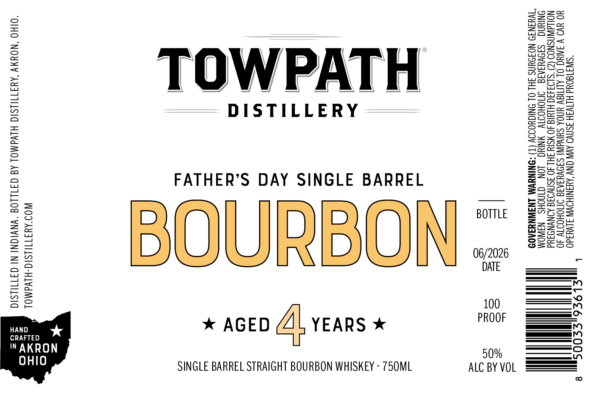

# TTB COLA Label Images - TTBID 26055001000799

**Brand Name:** TOWPATH

**Fanciful Name:** FATHER'S DAY SINGLE BARREL

**Issue Date:** 03/11/2026

**Origin Code:** 09

**Product Class/Type:** 101

**Source:** [TTB Public COLA Registry](https://ttbonline.gov/colasonline/viewColaDetails.do?action=publicFormDisplay&ttbid=26055001000799)

## Label Images

### Label 1

## Extracted Label Text

*Text extracted via OCR - may contain errors*

### Label 1

b pS L9OS6pSSOOS ay, 8

“SIW3180¥d HITVIH ISNVO AVN ONY ‘AUANIHOWW JLvuad0
YO YvO VAAN OL ALITY YNOA SHIVA SIDVYIAIG IMOHOITV 40
NOLLdWNSNOD (2) "SL04440 HLMIG 40 WSIY SHI 40 ISNVOIG AINYNDIUd
SONIUAG =SIOVUSIAIG ONOHOIIY NING LON CINOHS NAWOM
TWHIN39 NOFOUNS FHL OL ONIGYOIOY (T) “ONINUVM INAWNYAAOD

ALC BY VOL

[
oo

DISTILLERY
YEARS *

FATHER’S DAY SINGLE BARREL
* AGED

SINGLE BARREL STRAIGHT BOURBON WHISKEY - 750ML

WOD'AYFTIILSIG-HLVdMOL
“OIHO ‘NOUMY ‘AMATTILSIC HLVdMOL Ad G4TLLOd “WNVIGNI NI G3TTILSIC
