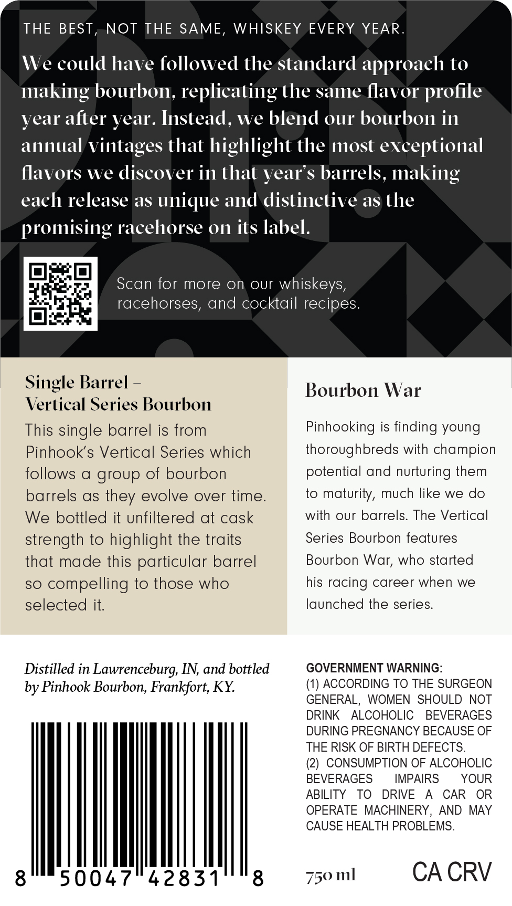
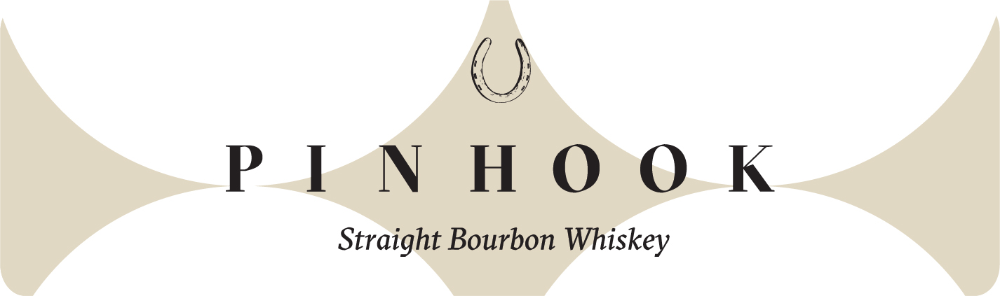

# TTB COLA Label Images - TTBID 26055001000839

**Brand Name:** PINHOOK

**Issue Date:** 02/25/2026

**Origin Code:** 22

**Product Class/Type:** 101

**Source:** [TTB Public COLA Registry](https://ttbonline.gov/colasonline/viewColaDetails.do?action=publicFormDisplay&ttbid=26055001000839)

## Label Images

### Back Label

### Front Label

## Extracted Label Text

*Text extracted via OCR - may contain errors*

*1 image(s) excluded: text did not meet readability threshold*

### Back Label

THE BEST, NOT THE SAME, WHISKEY EVERY YEAR.
We could have followed the standard approach to
making bourbon, replicating the same flavor profile
year after year. Instead, we blend our bourbon in
annual vintages that highlight the most exceptional
flavors we discover in that year’s barrels, making
each release as unique and distinctive as the
promising racehorse on its label.
pa Scan for more on our whiskeys,
pape nei
ease racehorses, and cocktail recipes.
im
Single Barrel = BourbontWar
Vertical Series Bourbon
This single barrel is from Pinhooking is finding young
Pinhook’s Vertical Series which thoroughbreds with champion
follows a group of bourbon potential and nurturing them
barrels as they evolve over time. to maturity, much like we do
We bottled it unfiltered at cask with our barrels. The Vertical
strength to highlight the traits Series Bourbon features
that made this particular barrel Bourbon War, who started
so compelling to those who his racing career when we
selected it. launched the series.
Distilled in Lawrenceburg, IN, and bottled GOVERNMENT WARNING:
by Pinhook Bourbon, Frankfort, KY. (1) ACCORDING TO THE SURGEON
GENERAL, WOMEN SHOULD NOT
DRINK ALCOHOLIC BEVERAGES
DURING PREGNANCY BECAUSE OF
THE RISK OF BIRTH DEFECTS.
(2) CONSUMPTION OF ALCOHOLIC
BEVERAGES IMPAIRS YOUR
ABILITY TO DRIVE A CAR OR
OPERATE MACHINERY, AND MAY
CAUSE HEALTH PROBLEMS.
8500474283108 = 750ml CACRV
