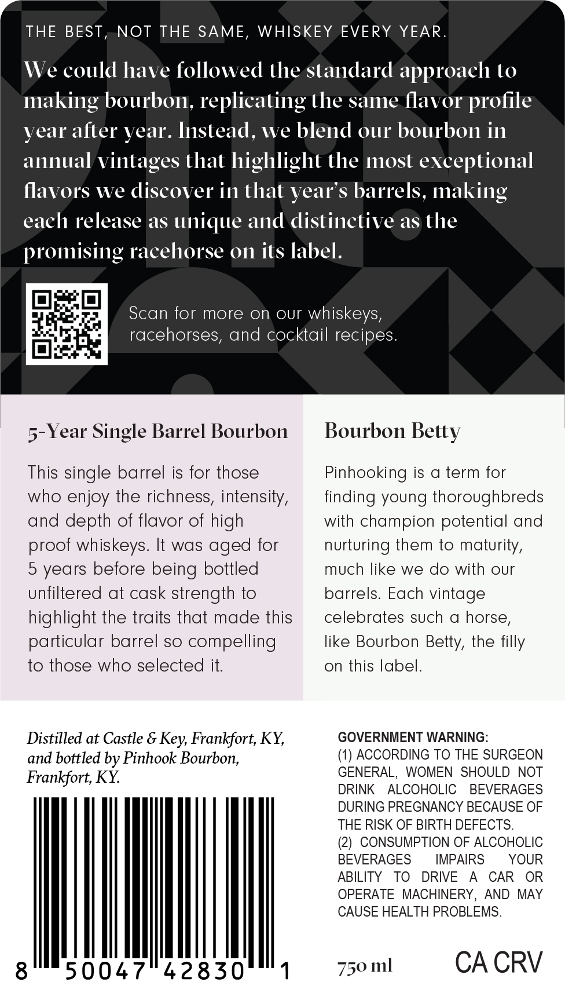

# TTB COLA Label Images - TTBID 26055001000843

**Brand Name:** PINHOOK

**Issue Date:** 02/25/2026

**Origin Code:** 22

**Product Class/Type:** 101

**Source:** [TTB Public COLA Registry](https://ttbonline.gov/colasonline/viewColaDetails.do?action=publicFormDisplay&ttbid=26055001000843)

## Label Images

### Back Label

### Front Label

## Extracted Label Text

*Text extracted via OCR - may contain errors*

**Detected Age:** 5 Years

### Back Label

THE BEST, NOT THE SAME, WHISKEY EVERY YEAR

We

could have

followed the standard approach to

making bourbon, replicating the same flavor profile

year after year. Instead, we

blend our bourbon in

annual vintages that highlight the most exceptional

flavors we

discover in that year’s

s barrels, making

each release as unique and distinctive as the

promising racehorse on its label

i

Scan for more on our whiskeys

racehorses, and cocktail recipes

oes

-Year Single Barrel Bourbon

Bourbon Betty

This single barrel is for those

Pinhooking is a term for

who enjoy the richness, intensity,

finding young thoroughbreds

and depth of flavor of high

with champion potential and

proof whiskeys. It was aged for

nurturing them to maturity,

5 years before being bottled

much like we do with our

unfiltered at cask strength to

barrels. Each vintage

celebrates such a horse

highlight the traits that made this

particular barrel so compelling

like Bourbon Betty, the filly

to those who selected it

on this label

Distilled at Castle & Key, Frankfort, KY,

GOVERNMENT WARNING

and bottled by Pinhook Bourbon,

(1) ACCORDING TO THE SURGEON

GENERAL, WOMEN SHOULD NOT

Frankfort, KY.

RINK ALCOHOLIC BEVERAGES

DURING PREGNANCY BECAUSE OF

THE RISK OF BIRTH DEFECTS.

(2) CONSUMPTION OF ALCOHOLIC

BEVERAGES

IMPAIRS

YOUR

ABILITY TO DRIVE A CAR OR

OPERATE MACHINERY, AND MAY

CAUSE HEALTH PROBLEMS.

|

750 ml

CA CRV

### Front Label

PINHOOK
Kentucky Straight Bourbon Whiskey
