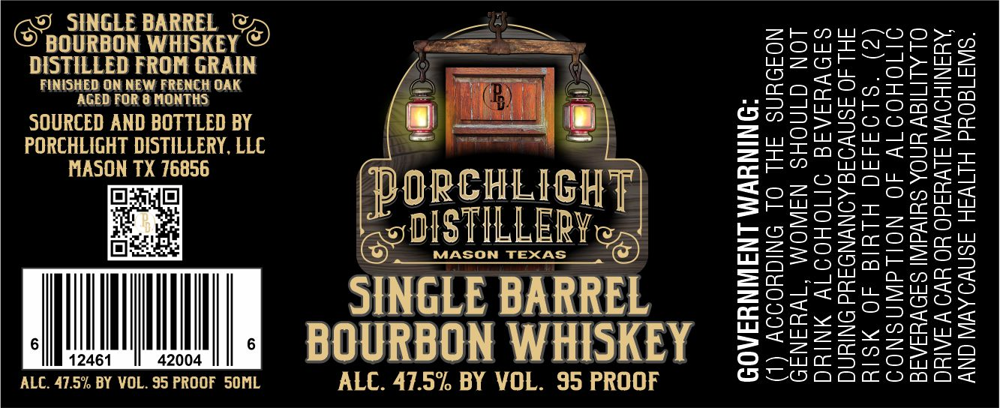

# TTB COLA Label Images - TTBID 26055001000861

**Brand Name:** PORCHLIGHT DISTILLERY

**Issue Date:** 03/03/2026

**Origin Code:** 44

**Product Class/Type:** 141

**Source:** [TTB Public COLA Registry](https://ttbonline.gov/colasonline/viewColaDetails.do?action=publicFormDisplay&ttbid=26055001000861)

## Label Images

### Label 1

## Extracted Label Text

*Text extracted via OCR - may contain errors*

**Detected Proof:** 95

### Label 1

eo SINGLE BARREL
BOURBON WHISKEY
DISTILLED FROM GRAIN

FINISHED ON NEW FRENCH OAK
AGED FOR 8 MONTHS

SOURCED AND BOTTLED BY

| SINGLE BARREL
BOURBON WHISKEY

ALC. 47.5% BY VOL. 95 PROOF 5OML ALC. 47.5% BY VOL. 95 PROOF

ORCHLIGH
POSTILLER

MASON TEXAS

6 6

12461 42004

(2)

(1) ACCORDING TO THE SURGEON
GENERAL, WOMEN SHOULD NOT
DRINK ALCOHOLIC BEVERAGES
DURING PREGNANCY BECAUSE OF THE
RISK OF BIRTH DEFECTS.

CONSUMPTION OF ALCOHOLIC
BEVERAGES IMPAIRS YOUR ABILITY TO
DRIVE A CAR OR OPERATE MACHINERY,
AND MAYCAUSE HEALTH PROBLEMS.

GOVERNMENT WARNING:
