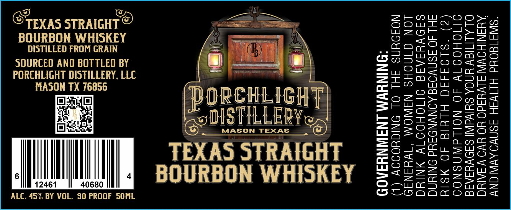

# TTB COLA Label Images - TTBID 26055001000865

**Brand Name:** PORCHLIGHT DISTILLERY

**Issue Date:** 03/17/2026

**Origin Code:** 44

**Product Class/Type:** 101

**Source:** [TTB Public COLA Registry](https://ttbonline.gov/colasonline/viewColaDetails.do?action=publicFormDisplay&ttbid=26055001000865)

## Label Images

### Label 1

## Extracted Label Text

*Text extracted via OCR - may contain errors*

**Detected Proof:** 60

### Label 1

OTExAS STRAIGHT ©
BOURBON WHISKEY
DISTILLED FROM GRAIN
SOURCED AND BOTTLED BY
PORCHLIGHT DISTILLERY, LLC
MASON TX 76856
t=1i4iel

6 | | | 4

12461 40680
ALC. 45% BY VOL. 30 PROOF SOML

B=) i gq) eS
s\— 8
ORCHLIGH
POSTILLERY

MASON TEXAS

TEXAS STRAIGHT
BOURBON WHISKEY

GOVERNMENT WARNING:

2)

CONSUMPTION OF ALCOHOLIC

(

(1) ACCORDING TO THE SURGEON
GENERAL, WOMEN SHOULD NOT
DRINK ALCOHOLIC BEVERAGES
DURING PREGNANCY BECAUSE OF THE
RISK OF BIRTH DEFECTS.

BEVERAGES IMPAIRS YOUR ABILITY TO
DRIVE A CAR OR OPERATE MACHINERY,
AND MAYCAUSE HEALTH PROBLEMS.
