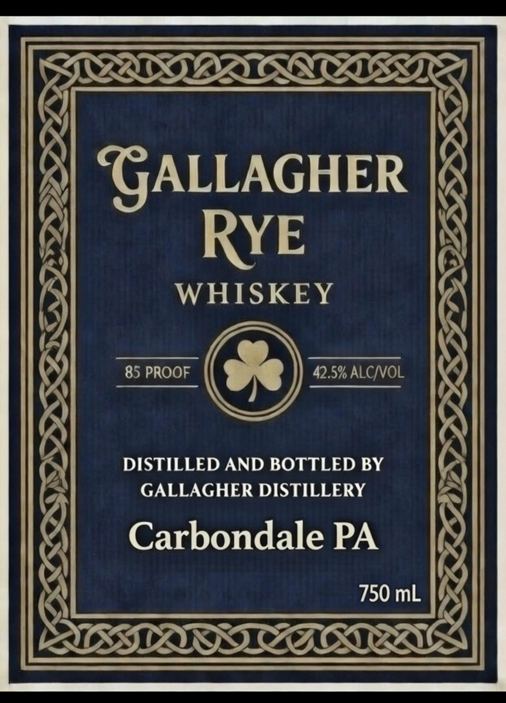
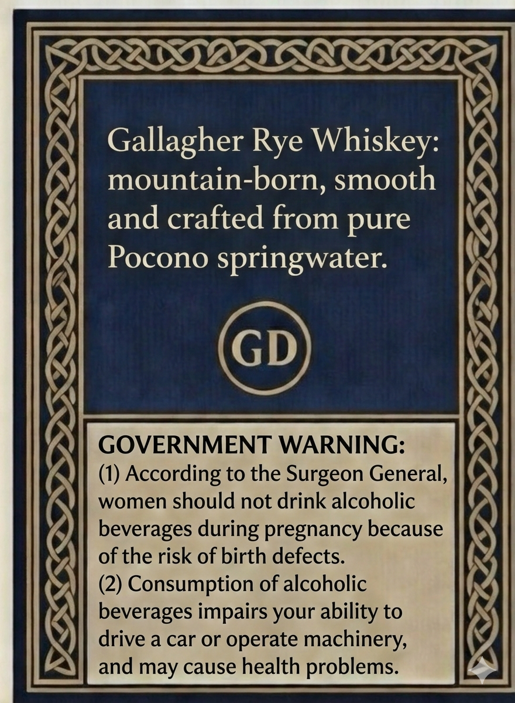

# TTB COLA Label Images - TTBID 26056001000062

**Brand Name:** GALLAGHER RYE WHISKEY

**Issue Date:** 03/02/2026

**Origin Code:** 39

**Product Class/Type:** 142

**Source:** [TTB Public COLA Registry](https://ttbonline.gov/colasonline/viewColaDetails.do?action=publicFormDisplay&ttbid=26056001000062)

## Label Images

### Label 1

### Label 2

## Extracted Label Text

*Text extracted via OCR - may contain errors*

**Detected Proof:** 85

### Label 1

| PISO AR sa
\

PID

“GALLAGHER |@

RYE

WHISKEY

85 PROOF 42.5% ALC/VOL

DISTILLED AND BOTTLED BY
GALLAGHER DISTILLERY

Carbondale PA
750 mL

cS.

DBASE

GSS

### Label 2

NA)

SRD OA OLA ERT)

LX

R22

Gallagher Rye Whiskey:
mountain-born, smooth
and crafted from pure
Pocono springwater.

GOVERNMENT WARNING:

(1) According to the Surgeon General,
women should not drink alcoholic
beverages during pregnancy because
of the risk of birth defects.

(2) Consumption of alcoholic
beverages impairs your ability to
drive a car or operate machinery,

and may cause health problems.

SSH
SSE DILEIONOS

ae ee

(S

‘

=<

f

SAS
LILES

ZZ
IZ

ad
P29

——

CAN
<~

RNR

LD

=
ZBL

Ny
