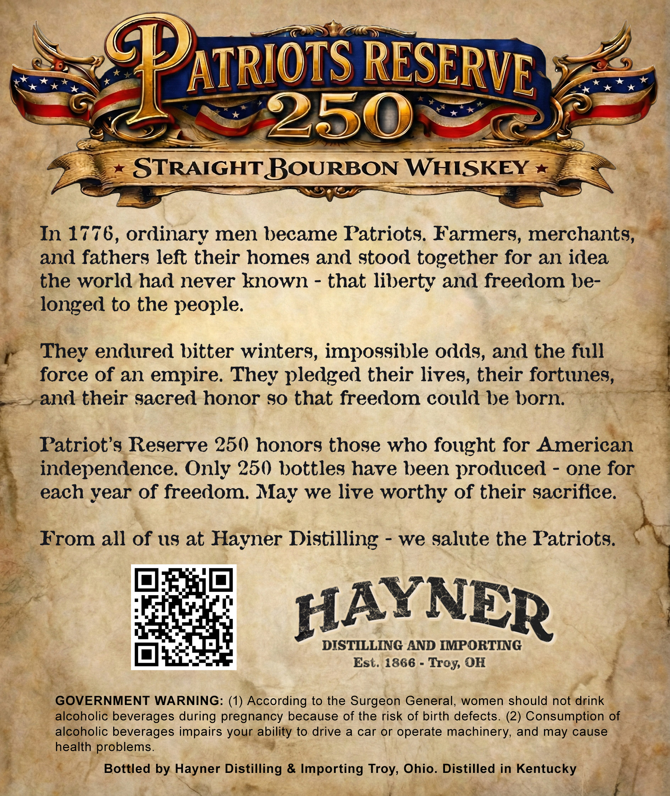
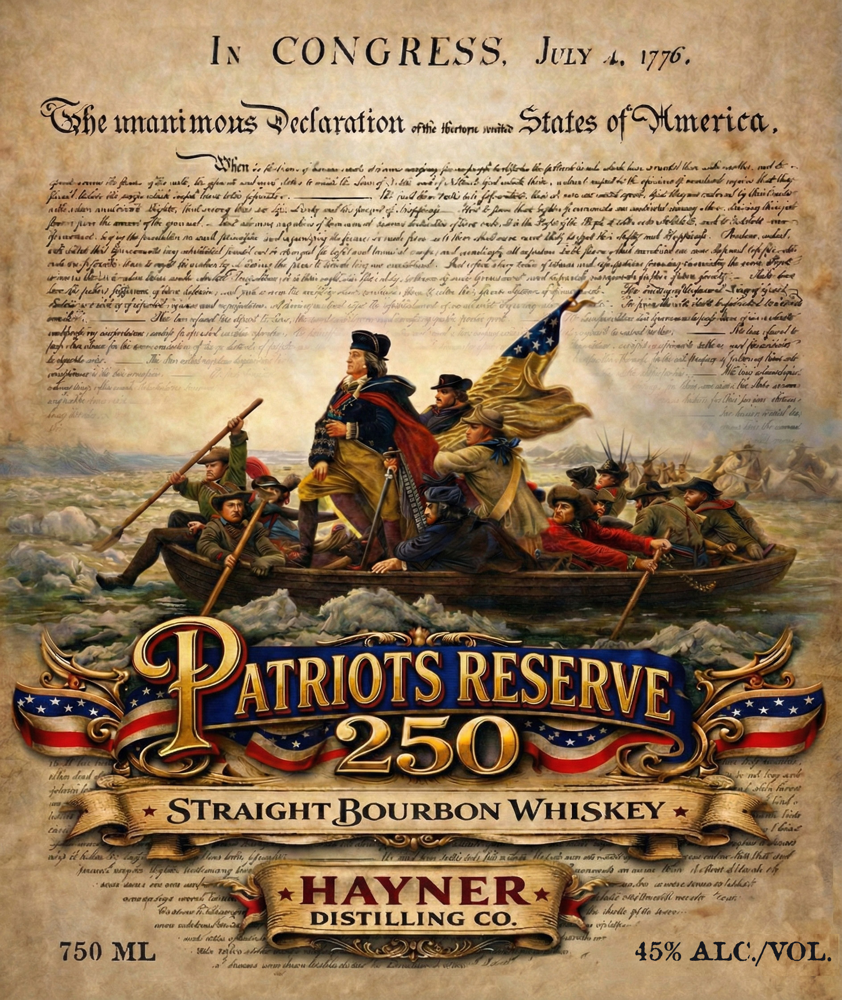

# TTB COLA Label Images - TTBID 26056001000123

**Brand Name:** HAYNER DISTILLING CO.

**Fanciful Name:** PATRIOTS RESERVE 250

**Issue Date:** 02/27/2026

**Origin Code:** 09

**Product Class/Type:** 101

**Source:** [TTB Public COLA Registry](https://ttbonline.gov/colasonline/viewColaDetails.do?action=publicFormDisplay&ttbid=26056001000123)

## Label Images

### Back Label

### Front Label

## Extracted Label Text

*Text extracted via OCR - may contain errors*

**Detected Proof:** 80

### Back Label

2%

<a

4

ee

WN /

Gs

mn) A

ak we Lk

’” *

Sy

“we

ATRIOTS RESERVE

Yas

LE.

Sg

on gs

Me

shee

yal

ied

(, aw)

)

ae

Kel)

; oe te)

STRAIGHT BOURBON WH ISKEY

S

ww Ddet

=

%

“In 1776, ordinary men became Patriots. Farmers merchants#aam

;

and fathers left their homes and stood together for an idea

~%

the world had never known - that liberty and freedom be-

¢

~ _ longed to the people.

“They endured bitter winters, impossible odds, and the full

force of an empire. They pledged their lives, their fortunes

ae

oa

~»and their sacred honor so that freedom could be born

Patriot’s Reserve 250 honors those who fought for American

_ independence. Only 250 bottles have been produced - one for

each year of freedom. May we live worthy of their sacrifice.

—

From all of us at Hayner Distilling - we salute the Patriotal

=

Co ae

ha

101

ee

rete

iL

=

H AY NER

a

hos,

DISTILLING AND IMPORTING

Est. 1866 - Troy, OH

7

Be GOVERNMENT WARNING:

(1) Recording to the Surgeon General, women should not drink”

ear

icoholic beverages during pregnancy because of the risk of birth defects. (2) Consumption of

(ee * aleptolic beverages impairs your i DUey to drive a car or operate machinery, and may cause

health | problems.

-

2

a

oy

.

Bottled by Hayner Distilling & Importing ray, Ohio. Distilled in Kentucky

*%

-

ty

SS

ae

oo.

ri

-

+

ae

### Front Label

In CON oD, uk
N NGRESS, Juty 4, 1776.
C~%{ 4 a) é °
-, ow
. ¢ Hbertopie svritee ’
“Cohe mami rons Declaration av sem min States of Winrerica
IM oe Knene y hanna seers Apa Lnraedroph herbllrke bie feHitirh dir tl. ahah hur srvctil lhor ache vselhed gad &
Grmtvecniw (To fate 4 Ee ule, ben gfant ae Pe, wnat E Saw gs Saal ote kp lcce ce . They enpecl M fine ff ld mg teat lhe
frat Leder (itt nagie ew. belts fount, ——_____. Va ind, bites Pelt tal fofralee, hen oh nate weit ryeot, Gist Mey mat calender
ake clan anulorwe iy hte, leuluccorg Mes te Sei sid ened bis fog lrapfocage Hert £ fires Kw S jhe $i evnrvomiile mt savolevels shsseg By ao mee
fort ir the amen: ya inavaled yoo nap ab wu of hon vain Seariad hevbindiss ofvive cube, Bt lla Poh y the Bipd thd cto RhUGE, aard CMs nee
prvenace. ey a 10 arasll flirwejite sub asuarissing Ma fecares 0 iuadl fitee eth Ueor Kadoure carve Mkts bi pat Her fab beg Sheslene, wwebest,
oat apsaessied whiibeteel fill car! rh hergeal ft bat avel lmowi'al cuffs) an Leseneliysy all aofaatos ey PS onsreb sad rte wn ey ge
; aed Om, iS. ace Hiatadhcr Top cali eas tiie llc aeons OGisoak Heicz sane esnihendé. Feel ofoccatecy Kode pf Wasai ined. (ageifuaatas (consaapitgetan ore, Ze
Say, engaana sa Bah Soh Painless mylists Fu:.Lg, whom pornd frau n apurcl cigleecs lek flame ti ene
Lace Mei frohirs Jefgirvers of tee doliavivey veel Hue a2 etc reeg elle (tes, Jack r Spe rues 11 Ceflaswree SX ai PEON
4 Boles wctiaciiey 7 cfr, tyames wal wc ryiadaton. wo «ae a face deve fe tpl
ancy, — Thee bars faced Laz dei arcemsleppagps SMe
ya heyy Mh uf eter walrel terlle;, —~~— Shtttba iflared be
Aaainlnace fr bhcrgnnrorain \ rea belllees rand frwnitecteg ?
healpeckle sé: e Th es Ee fT #4 cctiab eg tie
yes ; a Za 4 Mo ta
edn ius 6 7 a a ee, . we saint [etiallabe tlaeec
aepaold i YS, S— ms on it alt
he pac: Se — | ae hese patil dey
hu SE Sw Lor > —, 00; Po comad >

i Wa a rma

pa AR, a - S ‘ xR vy be Oo ex \

= 2 - mt —_ Bl ‘ on : — ‘ y y ae f 7 RS

— ae .-; y iP my A D> * vo Wa — —

ee ys & Px x Le Wee ia { AN 14s ~ ee

— . = E Y bes he ae SO

—< ees ~~ aso 7 wv ae =a Ss >s"A2 est

’ ‘ ¥ A ~ oo 5 A x = oO eet > : a q

—__ J <h ilen Ping.. a =

soy Veal — . i ASS = . i

v z al « fp — = . .

PS ; ROS So een —~ / fe
= Wea / ) enn « » is eT AES ay we
aSS 7 ATRIOTS RESERVE. say

ako x ex « *&
NY ttl || —~— we a A
— =i — = (a oof ;
: = : = Q : (gw es _
4 ther doa of Rn aed = — =~ a ip dv mnt loey ane we
‘ora gia - NTE ;
am <> STRAIGHT BOURBON WHISKEY «J
“at —— - ________ =" Sy [bane
it wale SS eee —— S Se yo
and) of holla 5 f Lar, bf tai hn OL. i; Li mA a no 7c Mt Lhd de
fara wrap ie Es fediamang hn Sanne eisai eee ~~ orieweadd am oat W chew dlaak a
dows dares one occ sser/oalig aS \ 4 : =. a. ac wrcre deren 49 lahbesye
ee toe i VERGE es ltrvesill mecelir “eur
a ttovae om ; SS Tee
tt dg DISTILLING CO. Sac:
neds Wrhlas va ‘a ay 3 be yeq ek yee a Purell ree
150 ML 0 ere (40% ALC/VOL.
