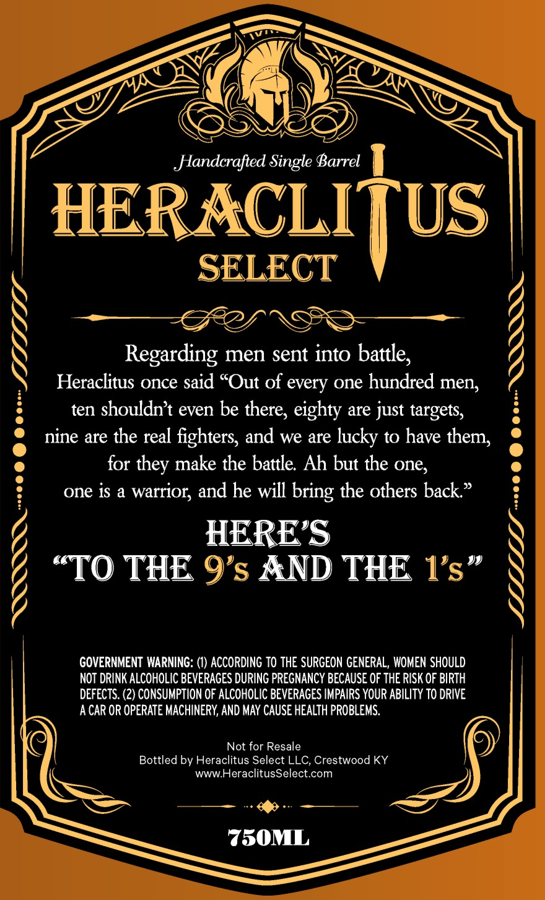
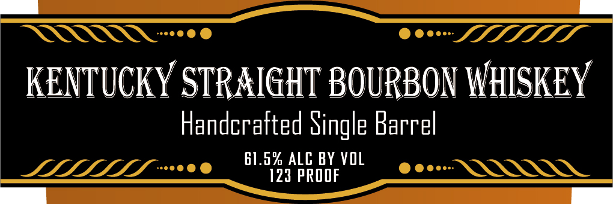
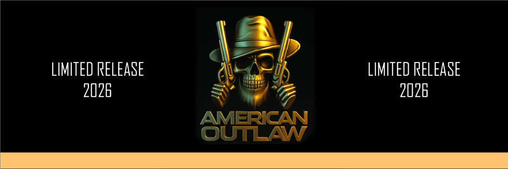

# TTB COLA Label Images - TTBID 26056001000177

**Brand Name:** HERACLITUS SELECT

**Fanciful Name:** AMERICAN OUTLAW

**Issue Date:** 03/03/2026

**Origin Code:** 22

**Product Class/Type:** 101

**Source:** [TTB Public COLA Registry](https://ttbonline.gov/colasonline/viewColaDetails.do?action=publicFormDisplay&ttbid=26056001000177)

## Label Images

### Back Label

### Front Label

### Label 3

## Extracted Label Text

*Text extracted via OCR - may contain errors*

**Detected Proof:** 122

### Back Label

ERROR G00 © 002

x
Handcrafted Single Barrel |

HERACLITUS
SLIP

Regarding men sent into battle,
Heraclitus once said “Out of every one hundred men,
ten shouldn’t even be there, eighty are just targets,
nine are the real fighters, and we are lucky to have them,
for they make the battle. Ah but the one,
one is a warrior, and he will bring the others back.”

HERE’S
“TO THE 9’s AND THE 1’s”

GOVERNMENT WARNING: (1) ACCORDING TO THE SURGEON GENERAL, WOMEN SHOULD
NOT DRINK ALCOHOLIC BEVERAGES DURING PREGNANCY BECAUSE OF THE RISK OF BIRTH
DEFECTS. (2) CONSUMPTION OF ALCOHOLIC BEVERAGES IMPAIRS YOUR ABILITY TO DRIVE
ACAR OR OPERATE MACHINERY, AND MAY CAUSE HEALTH PROBLEMS.

wwwHeraclitusSelect.com
er ee + —— “
750ML

Not for Resale ©
Bottled by Heraclitus Select LLC, Crestwood KY

220 @ @ @ eee LUNA

### Front Label

i

KENTUCKY STRAIGHT BOURBON

HISKEY

Handcrafted Single Barrel

61.0% ALC BY VOL

### Label 3

LIMITED RELEASE
2026

LIMITED RELEASE
2026

AMERICAN
OUTLAW
