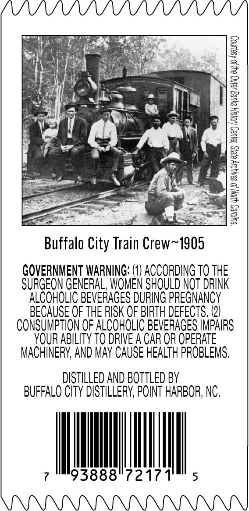
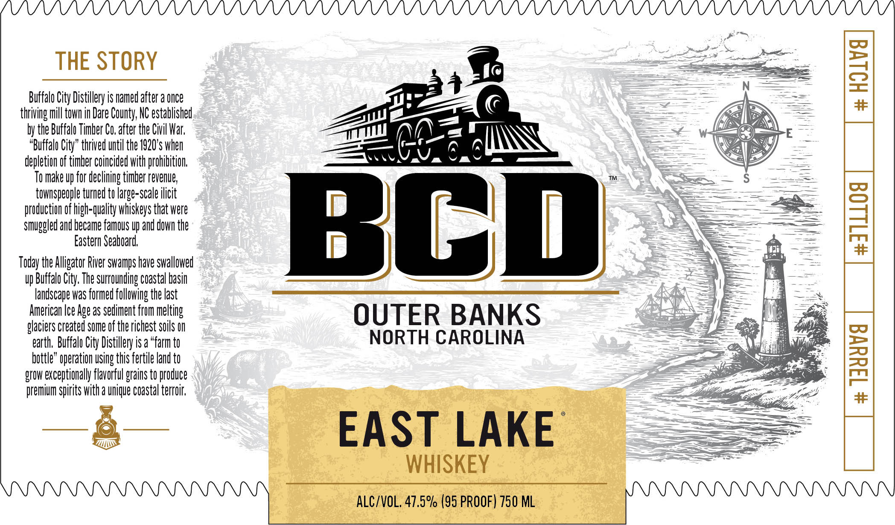
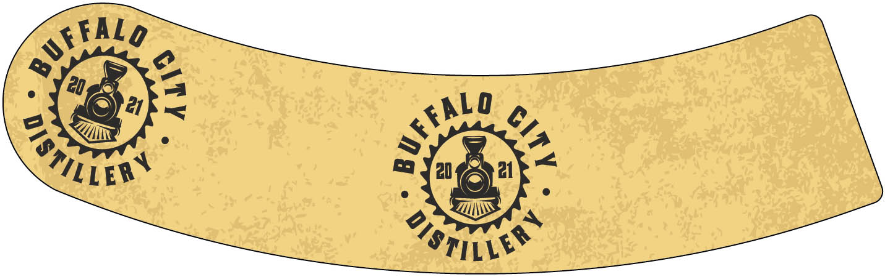

# TTB COLA Label Images - TTBID 26056001000316

**Brand Name:** BCD

**Issue Date:** 03/03/2026

**Origin Code:** 35

**Product Class/Type:** 140

**Source:** [TTB Public COLA Registry](https://ttbonline.gov/colasonline/viewColaDetails.do?action=publicFormDisplay&ttbid=26056001000316)

## Label Images

### Back Label

### Front Label

### Label 3

## Extracted Label Text

*Text extracted via OCR - may contain errors*

*1 image(s) excluded: text did not meet readability threshold*

**Detected Proof:** 95

### Back Label

Buffalo City Train Crew~1905

GOVERNMENT WARNING: (1) ACCORDING T0 THE
SURGEON GENERAL, WOMEN SHOULD NOT DRINK
ALCOHOLIC BEVERAGES DURING PREGNANCY
BECAUSE OF THE RISK OF BIRTH DEFECTS. (2)
CONSUMPTION OF ALCOHOLIC BEVERAGES IMPAIRS
YOUR ABILITY TO DRIVE A CAR OR OPERATE
MACHINERY, AND MAY CAUSE HEALTH PROBLEMS.

DISTILLED AND BOTTLED BY
BUFFALO CITY DISTILLERY, POINT HARBOR, NC.

2171

### Front Label

“Buffalo City” thrived u

THE STORY r &

City Distillery is named after a once
ing mill town in Dare County, NC established ee
the Buffalo Timber Co, after the Civil War.

il the 1920's whe ——

ti
ion of timber coincided with profibtion

} ——
O make up for declining timber revenue, ™
townspeople turned to large-scale ilicit
duction of high-quality whiskeys that were —S
ed! and became famous up and down the
Eastern Seaboard,
Today the Alligator River swamps have swallowed

Buffalo City, The surrounding coastal bas
andscape was formed following the last
ican Ice Age as sediment from melting

iers created some of the richest soils OUTER BANKS
arth, Buffalo City Distillery is a “farm t NORTH CAROLINA

e” operation using this fertile land ti

xceptionally flavorful grains to produce
ium spirits with a unique coastal terroi

EAST LAKE

WHISKEY

NII ALC/VOL. 47.5% (95 PROOF) 750 ML
