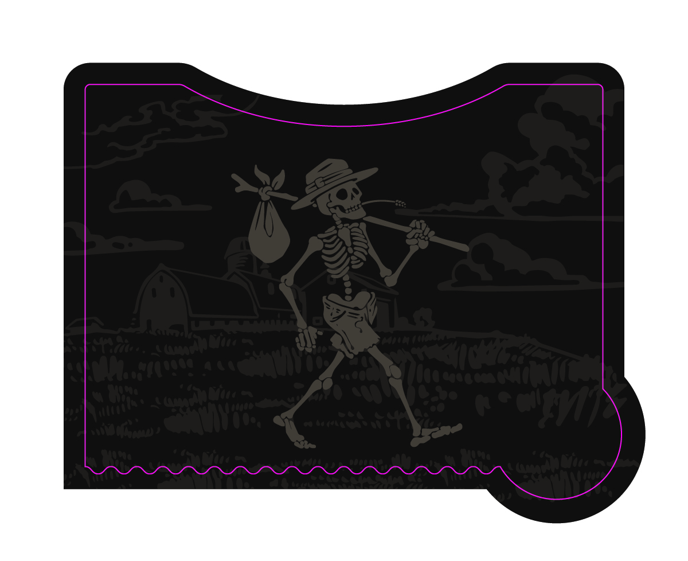
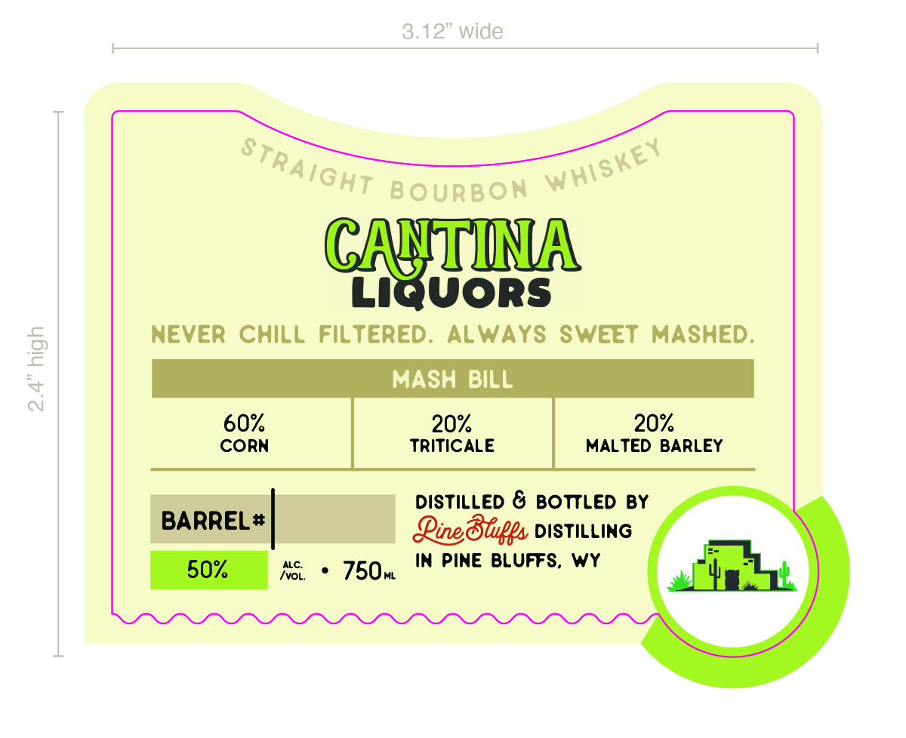

# TTB COLA Label Images - TTBID 26056001000395

**Brand Name:** PINE BLUFFS DISTILLING

**Fanciful Name:** CANTINA LIQUORS

**Issue Date:** 03/03/2026

**Origin Code:** 49

**Product Class/Type:** 101

**Source:** [TTB Public COLA Registry](https://ttbonline.gov/colasonline/viewColaDetails.do?action=publicFormDisplay&ttbid=26056001000395)

## Label Images

### Back Label

### Front Label

### Label 4

## Extracted Label Text

*Text extracted via OCR - may contain errors*

*2 image(s) excluded: text did not meet readability threshold*

### Front Label

2.4” high

3.12” wide
1

LIQUORS

NEVER CHILL FILTERED. ALWAYS SWEET MASHED.
MASH BILL

TRITICALE MALTED BARLEY

DISTILLED & BOTTLED BY
BARREL* Qing Blips DISTILLING

50% NS © 750m IN PINE BLUFFS, WY
