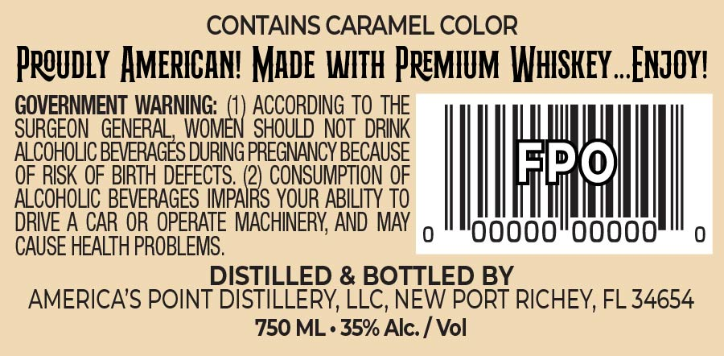

# TTB COLA Label Images - TTBID 26056001000431

**Brand Name:** AMERICA'S POINT DISTILLERY

**Fanciful Name:** SALTED CARAMEL

**Issue Date:** 03/09/2026

**Origin Code:** 16

**Product Class/Type:** 149

**Source:** [TTB Public COLA Registry](https://ttbonline.gov/colasonline/viewColaDetails.do?action=publicFormDisplay&ttbid=26056001000431)

## Label Images

### Front Label

## Extracted Label Text

*Text extracted via OCR - may contain errors*

**Detected Proof:** 70

### Front Label

CONTAINS CARAMEL COLOR
Preudly HMERICAN! Made WITH Premium Whskey _Enzoy?
GOVERNMENT WARNING;  (1) ACCORDING TO THE
SURGEON   GENERAL, WOMEN SHOULD  NOT   dRINK
ALCOHOLIC BEVERAGES DURING PREGNANCY BECAUSE
0
OF RISK OF BIRTH DEFECTS . (2) CONSUMPTION OF
ALCOHOLIC BEVERAGES IMPAIRS YOUR ABILITY TO
DRIE A CAR OR OPERATE MACHINERY; AND MAY
0
0uu
0
0uu
CAUSE HEALTH PROBLEMS.
DISTILLED & BOTTLED BY
AMERICA'S POINT DISTILLERY, LLC, NEW PORT RICHEY, FL 34654
750 ML . 35% Alc: _
Vol
