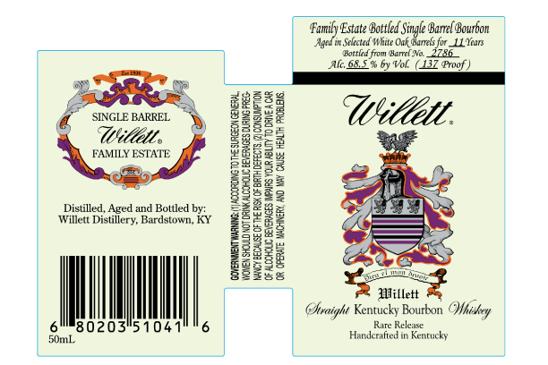

# TTB COLA Label Images - TTBID 26056001000523

**Brand Name:** WILLETT

**Issue Date:** 02/26/2026

**Origin Code:** 22

**Product Class/Type:** 101

**Source:** [TTB Public COLA Registry](https://ttbonline.gov/colasonline/viewColaDetails.do?action=publicFormDisplay&ttbid=26056001000523)

## Label Images

### Label 1

## Extracted Label Text

*Text extracted via OCR - may contain errors*

### Label 1

eee ‘Estate Bottled Single Bane Bourbon
Aged in Selected White Ook Barrels for 1 Years
ted frm are 228
AluGB.5% by Vol. (137 Pref)
f »  «gRES 9
@ swornane. ayia Uitlel.
FAMILY ESTATE GeGsy i
~ a eee 2 am
Bo bos ey
= ge Ari
Distt gcime a SERS 6 SO Gao
Willett Distillery, Bardstown, KY BE ee SS
a Ey jj
bol | agpees
Beese ee
ary -
Awaight Kentucky Bourdon Whishey
6M80203'51041" "6 vn RBS
SomL. mic in enticly
