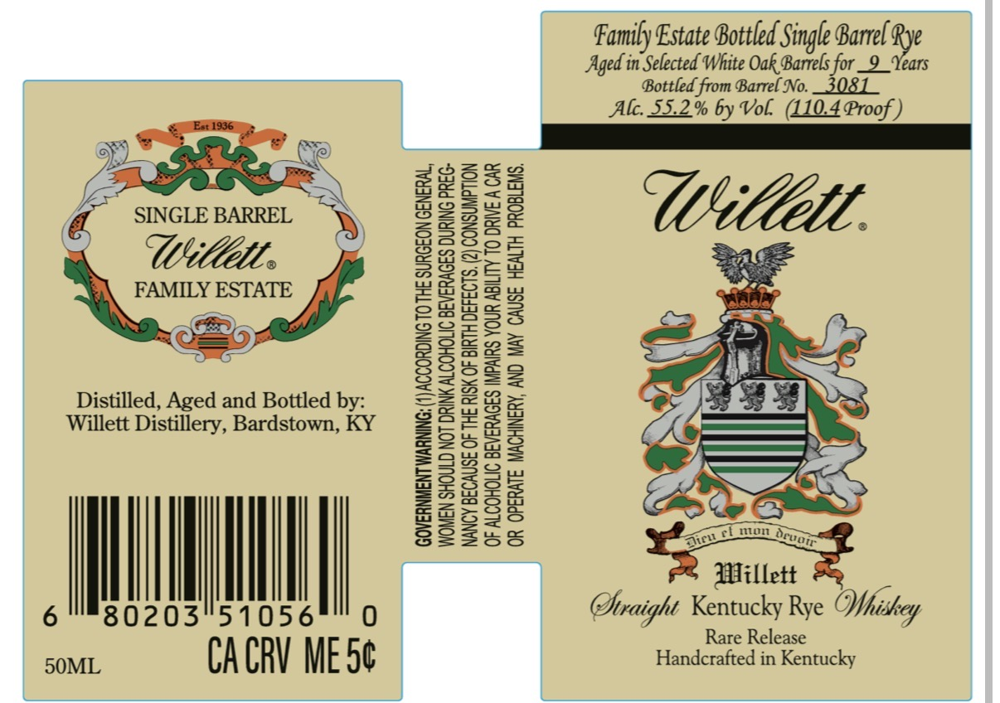

# TTB COLA Label Images - TTBID 26056001000528

**Brand Name:** WILLETT

**Issue Date:** 02/26/2026

**Origin Code:** 22

**Product Class/Type:** 102

**Source:** [TTB Public COLA Registry](https://ttbonline.gov/colasonline/viewColaDetails.do?action=publicFormDisplay&ttbid=26056001000528)

## Label Images

### Label 1

## Extracted Label Text

*Text extracted via OCR - may contain errors*

**Detected Proof:** 110.4

### Label 1

Family Estate Bottled Single Barrel fe
Auged in Selected White Oak Barrels for_9 Years

Bottled from Barrel No. _3081
Alc. 55.2% by Vol. (110.4 Proof )

UWttlll.
FAMILY ESTATE
SS

Distilled, Aged and Bottled by:
Willett Distillery, Bardstown, KY

| lll | [ Willett
Se oOS6se00

8020 Phraight Kentucky Rye Nhihey
Rare Release
50ML CA CRV ME it Handcrafted in Kentucky

WOMEN SHOULD NOT DRINK ALCOHOLIC BEVERAGES DURING PREG-
NANCY BECAUSE OF THE RISK OF BIRTH DEFECTS. (2) CONSUMPTION
OF ALCOHOLIC BEVERAGES IMPAIRS YOUR ABILITY TO DRIVE A CAR

GOVERNMENT WARNING: (1) ACCORDING T0 THE SURGEON GENERAL,
OR OPERATE MACHINERY, AND MAY CAUSE HEALTH PROBLEMS.
