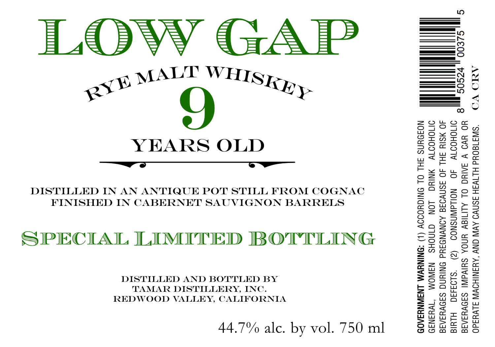

# TTB COLA Label Images - TTBID 26056001000587

**Brand Name:** LOW GAP

**Issue Date:** 02/26/2026

**Origin Code:** 01

**Product Class/Type:** 142

**Source:** [TTB Public COLA Registry](https://ttbonline.gov/colasonline/viewColaDetails.do?action=publicFormDisplay&ttbid=26056001000587)

## Label Images

### Label 1

## Extracted Label Text

*Text extracted via OCR - may contain errors*

**Detected Proof:** 89.4

### Label 1

ILOvVY GAP

YEARS OLD

DISTILLED IN AN ANTIQUE POT STILL FROM COGNAC
FINISHED IN CABERNET SAUVIGNON BARRELS

SPECIAL LIMITED BOTTLING

DISTILLED AND BOTTLED BY
TAMAR DISTILLERY, INC.
REDWOOD VALLEY, CALIFORNIA

44.7% alc. by vol. 750 ml

| 5

wo
KN
(se)
———S
—
aE
i &
BY
— i —
= 6

CONSUMPTION OF ALCOHOLIC

BEVERAGES IMPAIRS YOUR ABILITY TO DRIVE A CAR OR

(2)

WOMEN SHOULD NOT DRINK ALCOHOLIC

BEVERAGES DURING PREGNANCY BECAUSE OF THE RISK OF
OPERATE MACHINERY, AND MAY CAUSE HEALTH PROBLEMS.

GOVERNMENT WARNING: (1) ACCORDING TO THE SURGEON

BIRTH DEFECTS.

GENERAL,
