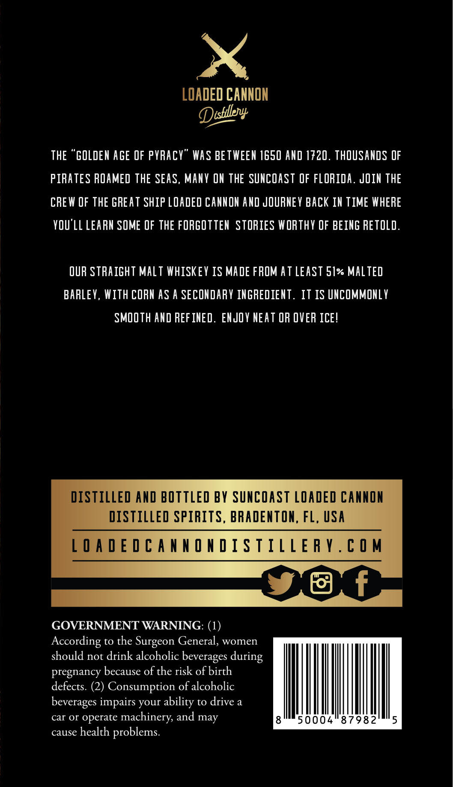
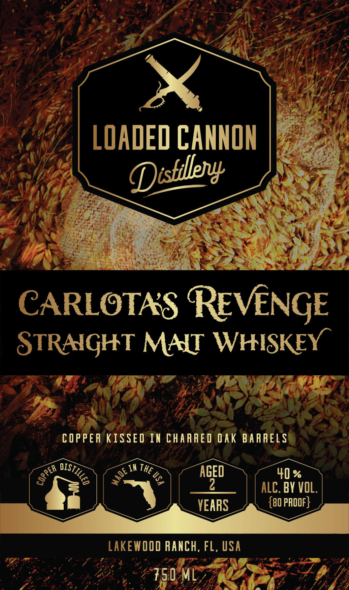

# TTB COLA Label Images - TTBID 26056001000620

**Brand Name:** LOADED CANNON

**Issue Date:** 03/11/2026

**Origin Code:** 16

**Product Class/Type:** 117

**Source:** [TTB Public COLA Registry](https://ttbonline.gov/colasonline/viewColaDetails.do?action=publicFormDisplay&ttbid=26056001000620)

## Label Images

### Back Label

### Front Label

## Extracted Label Text

*Text extracted via OCR - may contain errors*

**Detected Proof:** 80

### Back Label

x

LOADE

D CANNON

Dishtl

THE “GOLDEN AGE OF PYRACY” WAS BETWEEN 1650 AND 1720. THOUSANDS OF

PIRATES ROAMED THE SEAS, MANY ON THE SUNCOAST OF FLORIDA. JOIN THE

CREW OF THE GREAT SHIP LOADED CANNON AND JOURNEY BACK IN TIME WHERE

YOU'LL LEARN SOME OF THE FORGOTTEN STORIES WORTHY OF BEING RETOLD.

OUR STRAIGHT MALT WHISKEY 1S MADE FROM AT LEAST Sle MALTED

BARLEY, WITH CORN AS A SECONDARY INGREDIENT. IT IS UNCOMMONLY

SMOOTH AND REFINED. ENJOY NEAT OR OVER ICE!

DISTILLED AND BOTTLED BY SUNCOAST LOADED CANNON

DISTILLED SPIRITS, BRADENTON, FL, USA

LOAQDEDCANNONDISTILLERY.COM

J

Gf

NS

GOVERNMENT WARNING: (1)

According to the Surgeon General, women

should not drink alcoholic beverages during

pregnancy because of the risk of birth

defects. (2) Consumption of alcoholic

beverages impairs your ability to drive a

car or operate machinery, and may

50004°879

cause health problems.

### Front Label

LOADED CANNON
CARLOTAS REVNGE
STRAIGHT MNT WHISKEY
COPPER KISSED IX CHARRED QAK BARRELS
In
AGED
40 %
2
ALC. BY VOL.
YEARS
{80 prOOF}
LAkew_Od RAnCH, FL, USA
750 ML
Dtstillely
OLSTILLED
THE _
0
1
E
