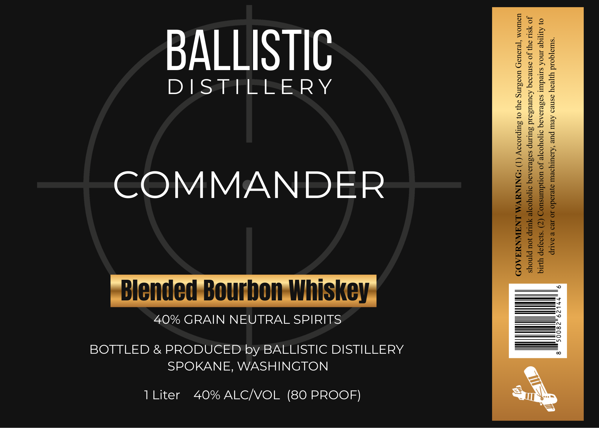

# TTB COLA Label Images - TTBID 26056001000628

**Brand Name:** COMMANDER

**Issue Date:** 03/02/2026

**Origin Code:** 07

**Product Class/Type:** 131

**Source:** [TTB Public COLA Registry](https://ttbonline.gov/colasonline/viewColaDetails.do?action=publicFormDisplay&ttbid=26056001000628)

## Label Images

### Label 1

## Extracted Label Text

*Text extracted via OCR - may contain errors*

**Detected Proof:** 80

### Label 1

BALLISTIC

DISTILLERY

COMMANDER

Blended Bourbon Whiskey

40% GRAIN NEUTRAL SPIRITS

BOTTLED & PRODUCED by BALLISTIC DISTILLERY
SPOKANE, WASHINGTON

1 Liter 40% ALC/VOL (80 PROOF)
