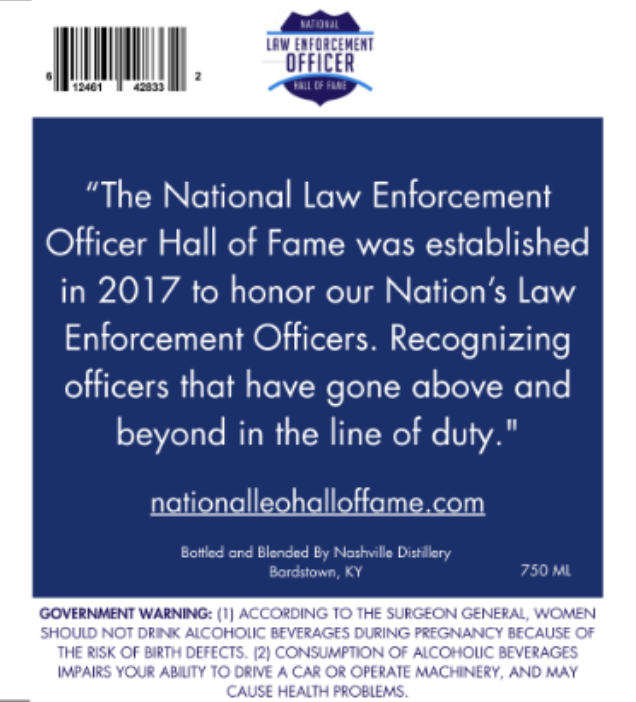
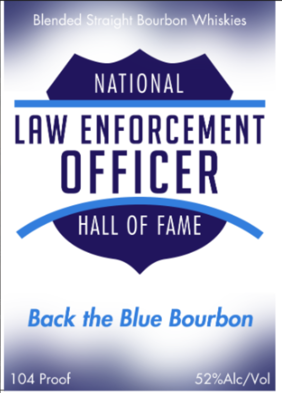

# TTB COLA Label Images - TTBID 26056001000660

**Brand Name:** BACK THE BLUE BOURBON

**Issue Date:** 03/04/2026

**Origin Code:** 22

**Product Class/Type:** 129

**Source:** [TTB Public COLA Registry](https://ttbonline.gov/colasonline/viewColaDetails.do?action=publicFormDisplay&ttbid=26056001000660)

## Label Images

### Back Label

### Front Label

## Extracted Label Text

*Text extracted via OCR - may contain errors*

**Detected Proof:** 104

### Back Label

Katnqji
dawtedFoncewent
oFFICER
"The National Law Enforcement
Officer Hall of Fame was established
in 2017 to honor our Nation'$ Law
Enforcement Officers. Recognizing
officers that have gone above and
beyond in the line of
nationalleohalloffame com
Boltlcd ord Blcnccd By Nothvllc Dirkry
Bordtiown KY
750 Ml
GOVERNMENT WARNING: (I ACCORDING I0 IHE SUFGEON GENERAL; WOMEN
SHOUID NOT DRIKK AICOHOIIC PFVERAGFS DURING PRFGNANCY BECAUSE 0
THHE RiSK Or BIRTH DEFECTS  12| CONSUMPTION OF AICOHOIIC BEVERAGES
Impairs YoUR Abuty I0 Crive ^ CAR Or OPERAIE MACHiNERY, AND MAY
CAUSE HEMITH PROBLEMAS.
duty:

### Front Label

Blended Stretaht Bourbon Whiskies
National
LAw ENFORCEMENT
OFFUCER
hall OF FAMe
Back the Blue Bourbon
104 Proof
52%Alc/Vol
