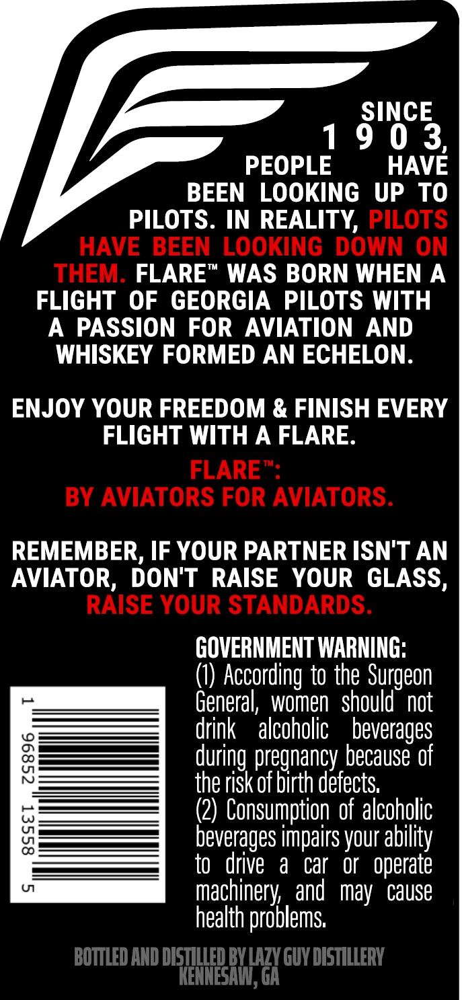
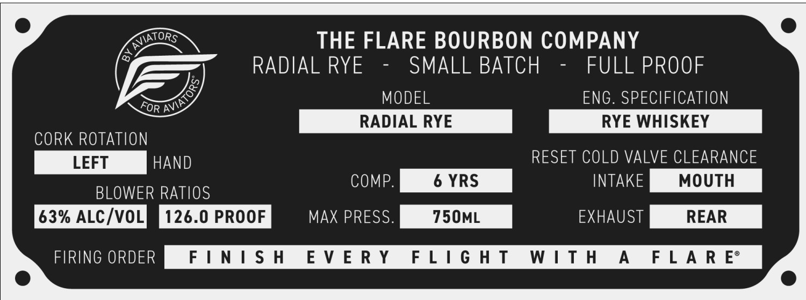
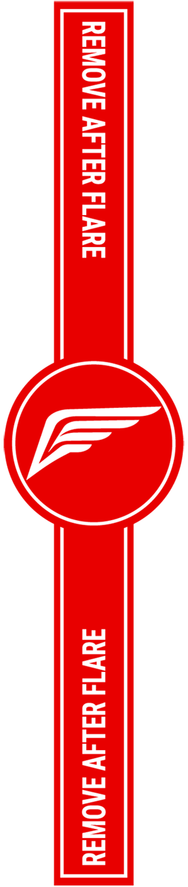

# TTB COLA Label Images - TTBID 26056001000786

**Brand Name:** FLARE

**Fanciful Name:** RADIAL RYE

**Issue Date:** 03/17/2026

**Origin Code:** 08

**Product Class/Type:** 142

**Source:** [TTB Public COLA Registry](https://ttbonline.gov/colasonline/viewColaDetails.do?action=publicFormDisplay&ttbid=26056001000786)

## Label Images

### Back Label

### Front Label

### Label 2

## Extracted Label Text

*Text extracted via OCR - may contain errors*

**Detected Proof:** 126
**Detected Age:** 6 Years

### Back Label

SINCE
9 0 3
PEOPLE
HAVE
BEEN
LOOKING UP TO
PILOTS. IN REALITY, PILOTS
HAVE BEEN LOOKING DOWN ON
THEM: FLARE
WAS BORN WHEN A
FLIGHT OF GEORGIA PILOTS WITH
A
PASSION FOR AVIATION
AND
WHISKEY FORMED AN ECHELON.
ENJOY YOUR FREEDOM & FINISH EVERY
FLIGHT WITH A FLARE.
FLARE
BY AVIATORS FOR AVIATORS.
REMEMBER, IF YOUR PARTNER ISN'T AN
AVIATOR, DON'T
RAISE
YOUR GLASS,
RAISE YOUR STANDARDS.
GOVERNMENT WARNING;
(0) According to the Surgeon
General,  women   should' not
drink
alcoholic
beverages
8
during pregnancy because of
the risk of birth defects;
(2) Consumption of alcoholic
8
beverages impairs your
to   drive
a
car
Or
operate
U1
machinery , and  may
cause
health problems;
BOTTLED AND DISZLLLED BYLAZY GUY DISTILLERY
KENNESAI,ga
ability

### Front Label

ES THE FLARE BOURBON COMPANY
Lay RADIAL RYE - SMALL BATCH - FULL PROOF

y MODEL ENG. SPECIFICATION

RADIAL RYE RYE WHISKEY

CORK ROTATION

LEFT HAND RESET COLD VALVE CLEARANCE
COMP. 6 YRS INTAKE MOUTH

63% ALC/VOLMM 126.0 PROOF MD@anassm =| 750ML Gre REAR |

mceehweanm FINISH EVERY FLIGHT WITH A FLARE

BLOWER RATIOS

### Label 2

REMOVE AFTER FLARE JUV 14 YILIV JAOWSY
