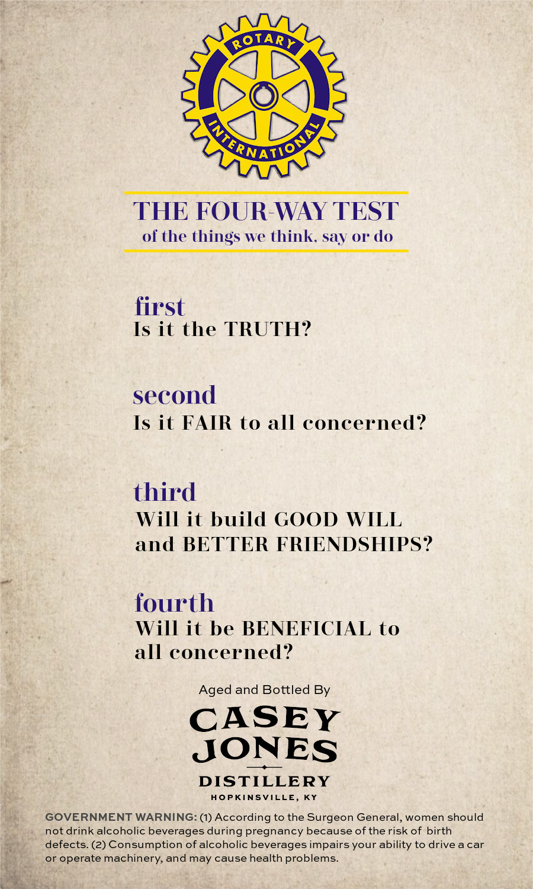
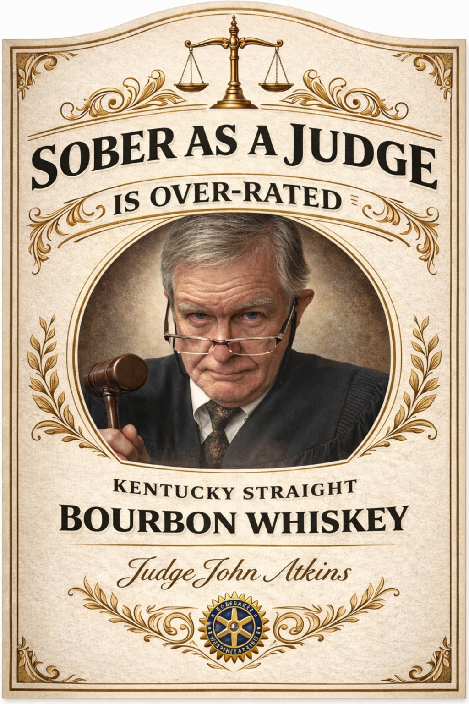

# TTB COLA Label Images - TTBID 26056001000844

**Brand Name:** SOBER AS A JUDGE

**Issue Date:** 03/02/2026

**Origin Code:** 22

**Product Class/Type:** 101

**Source:** [TTB Public COLA Registry](https://ttbonline.gov/colasonline/viewColaDetails.do?action=publicFormDisplay&ttbid=26056001000844)

## Label Images

### Back Label

### Front Label

## Extracted Label Text

*Text extracted via OCR - may contain errors*

### Back Label

ap

LO)

THE FOU She TEST

of the things we think. say or do

first

Is it the TRUTH?

second

Is it FAIR to all concerned?

third

Will it build GOOD WILL

and BETTER FRIENDSHIPS?

fourth

Will it be BENEFICIAL to

all concerned?

Aged and Bottled By

CASEY

JONES

DISTILLERY

HOPKINSVILLE, KY

not drink alcoholic beverages during pregnancy because of the risk of birth

GOVERNMENT WARNING: (1) According to the Surgeon General, women should

defects. (2) Consumption of alcoholic beverages impairs your ability to drive a car

of operate machinery, and may cause health problems.

MEY

### Front Label

ee

—_!>==

|

a

2G)

earn. RAS AJ UDGE

- OVER-RATEp =

s

—.

CONS

=)

 &

wet

J

AN

WA

y=

KENTUCKY STRAIGHT

BOURBON WHISKEY

aor

ne
