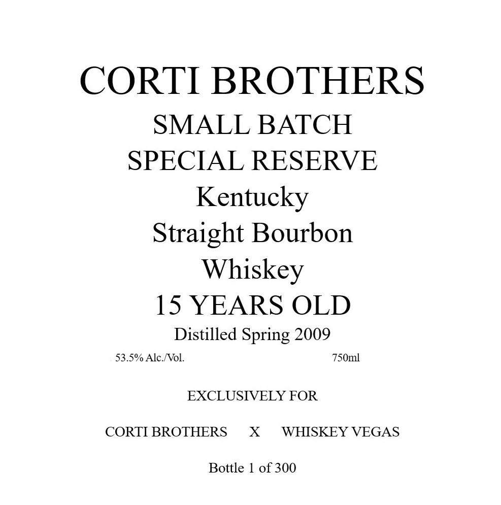
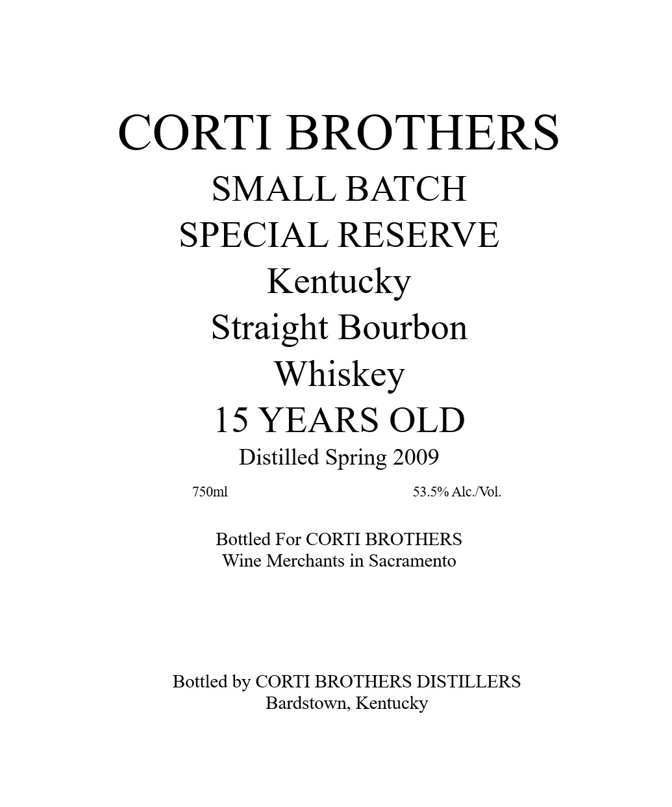

# TTB COLA Label Images - TTBID 26056001000867

**Brand Name:** CORTI BROTHERS

**Issue Date:** 02/27/2026

**Origin Code:** 22

**Product Class/Type:** 101

**Source:** [TTB Public COLA Registry](https://ttbonline.gov/colasonline/viewColaDetails.do?action=publicFormDisplay&ttbid=26056001000867)

## Label Images

### Back Label

### Label 1

### Label 3

## Extracted Label Text

*Text extracted via OCR - may contain errors*

**Detected Age:** 15 Years

### Back Label

CORTI BROTHERS
SMALL BATCH
SPECIAL RESERVE
Kentucky
Straight Bourbon
Whiskey
15 YEARS OLD
Distilled Spring 2009
EXCLUSIVELY FOR
CORTI BROTHERS X WHISKEY VEGAS
Bottle 1 of 300

### Label 1

CORTI BROTHERS
SMALL BATCH
SPECIAL RESERVE
Kentucky
Straight Bourbon
Whiskey
15 YEARS OLD
Distilled Spring 2009
Bottled For CORTI BROTHERS
Wine Merchants in Sacramento
Bottled by CORTI BROTHERS DISTILLERS
Bardstown, Kentucky

### Label 3

GOVERNMENT WARNING: {V ACCORDING TO THE
SURGEON GENERAL, WOMEN SHOULD NOT DRINK
ALCOHOLIC BEVERAGES DURING — PREGNANCY
BECAUSE OF THE RISK OF BIRTH DEFFECTS. 2)
CONSUMPTION OF ALCOHOLIC = BEVERAG
IMPAIRS YOUR_ ABILITY

TO DRIVE A CAR OR

OPERATE MACHINERY,

AND_ MAY CAUSE

HEALTH PROBLEMS. UPC - FOR POSITION ONLY
750ml
