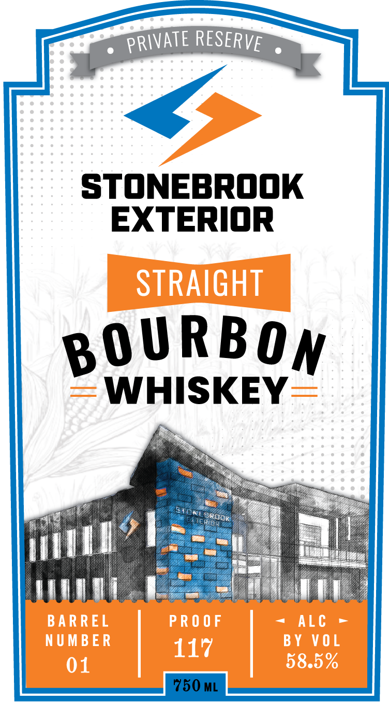

# TTB COLA Label Images - TTBID 26056001000925

**Brand Name:** STONEBROOK EXTERIOR

**Issue Date:** 02/27/2026

**Origin Code:** 31

**Product Class/Type:** 101

**Source:** [TTB Public COLA Registry](https://ttbonline.gov/colasonline/viewColaDetails.do?action=publicFormDisplay&ttbid=26056001000925)

## Label Images

### Back Label

### Front Label

## Extracted Label Text

*Text extracted via OCR - may contain errors*

### Back Label

oO STONEBROOK
EXTERIOR

At Stonebrook Exterior, our
reputation has been built from our
unyielding commitment to
excellence, which is evident in the
areas of safety, productivity, and
workmanship. We pride ourselves on
our innovative management style.
We will service your needs with a
highly proficient, safety-oriented,
and cost-efficient management
team who is ready to meet your
goals and objectives.

DISTILLED & BOTTLED BY

16380
= SIDESHOW ester

WWW.SIDESHOWSPIRITS.COM

vESHo

XN

> esto &

LINCOLN, NE’'S

18? DISTILLERY
2020

Piri

GOVERNMENT WARNING: (1) ACCORDING TO THE SURGEON GENERAL,
WOMEN SHOULD NOT DRINK ALCOHOLIC BEVERAGES DURING
PREGNANCY BECAUSE OF THE RISK OF BIRTH DEFECTS. (2) CONSUMPTION
OF ALCOHOLIC BEVERAGES IMPAIRS YOUR ABILITY TO DRIVE A CAR
OR OPERATE MACHINERY, AND MAY CAUSE HEALTH PROBLEMS.

### Front Label

PPORIVATE RESERVE

STONEBROOK
EXTERIOR

BOURBOYW

WHISKEY
