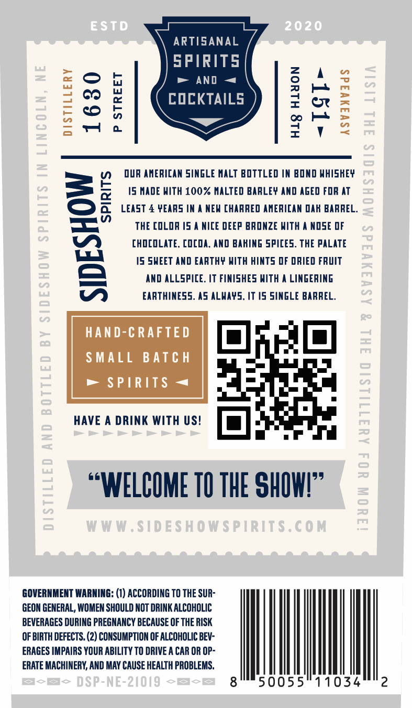
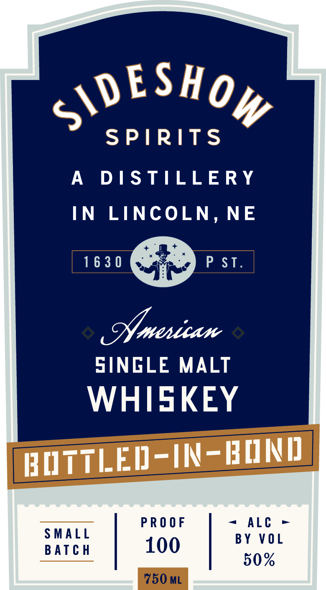

# TTB COLA Label Images - TTBID 26056001000933

**Brand Name:** SIDESHOW SPIRITS

**Issue Date:** 02/27/2026

**Origin Code:** 31

**Product Class/Type:** 119

**Source:** [TTB Public COLA Registry](https://ttbonline.gov/colasonline/viewColaDetails.do?action=publicFormDisplay&ttbid=26056001000933)

## Label Images

### Back Label

### Front Label

## Extracted Label Text

*Text extracted via OCR - may contain errors*

**Detected Proof:** 100

### Back Label

ARTISANAL

SPIRITS

=o

> AND ~

a

COCKTAILS

= Oo

VY) OUR AMERICAN SINGLE MALT BOTTLED IN BOND WHISHEY

=

=

15 MADE WITH 100% MALTED BARLEY AND AGED FOR AT

(=)

a

LEAST 4 ¥EARS IN A NEW CHARRED AMERICAN DAK BARREL.

=

THE COLOR 15 A NICE DEEP BRONZE WITH A NOSE OF

iV)

CHOCOLATE, COCOA, AND BAHING SPICES. THE PALATE

15 SWEET AND EARTHY WITH HINTS OF DRIED FRUIT

AND ALLSPICE. IT FINISHES WITH A LINGERING

EARTHINESS. AS ALWAYS, IT 15 SINGLE BARREL

HAND-CRAFTED

SMALL BATCH

> SPIRITS ~«

HAVE A DRINK WITH US! [a] .

“WELCOME TO THE SHOW!”

GOVERNMENT WARNING: (1) ACCORDING TO THE SUR

GEON GENERAL, WOMEN SHOULD NOT DRINK ALCOHOLIC

BEVERAGES DURING PREGNANCY BECAUSE OF THE RISK

OF BIRTH DEFECTS. (2) CONSUMPTION OF ALCOHOLIC BEV-

ERAGES IMPAIRS YOUR ABILITY TO DRIVE A CAR OR OP-

ERATE MACHINERY, AND MAY CAUSE HEALTH PROBLEMS.

Ml

|

50055

034" 2

### Front Label

VESHG

SPIRITS

A DISTILLERY

IN LINCOLN, NE

1630

+> PSI

Mmerican

SINGLE MALT

WHISKEY

RUTTLED-IN-BOND

SMALL

PROOF

= ALC >

BY VOL

BATCH

100

50%
