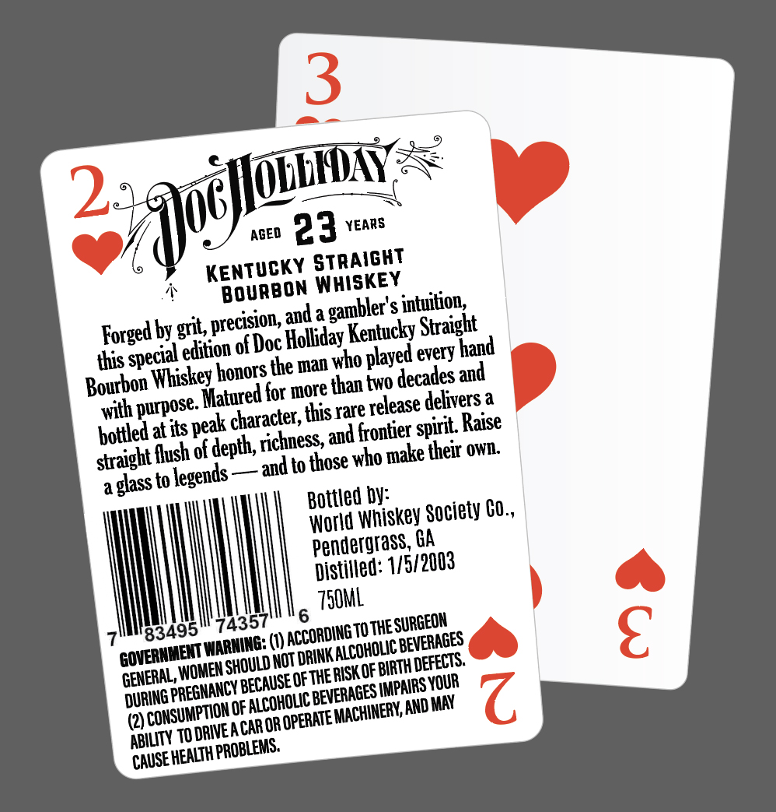
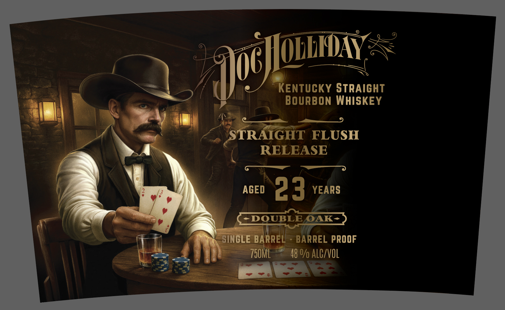

# TTB COLA Label Images - TTBID 26057001000050

**Brand Name:** DOC HOLLIDAY

**Issue Date:** 03/02/2026

**Origin Code:** 08

**Product Class/Type:** 101

**Source:** [TTB Public COLA Registry](https://ttbonline.gov/colasonline/viewColaDetails.do?action=publicFormDisplay&ttbid=26057001000050)

## Label Images

### Back Label

### Front Label

## Extracted Label Text

*Text extracted via OCR - may contain errors*

**Detected Age:** 3 Years

### Back Label

nr « 3
quntAy
yf AGED 2 3 YEARS
A KENTUCKY STRAIGHT
>» BOURBON WHISKEY
Forged by grit, precision, anda gambler's intuition,
this special etition of Doc Holliday Kentucky Straight
Bourbon Whiskey honors the man who played every hand
with purpose. Watured for more than two decades and
hottled at its peak character, this rare release delivers a
straight flush of depth, richness, and frontier spirit. Raise
a glass to Jegends — ani to those who make their own.
Bottled by:
World Whiskey Society C0.,
Penderarass, GA
Distited: 1/5/ 2003
7ililig3495 743516 TSOML
OVERNMENT WARHINE: ({y ACCORDING TO THE SURGEON
GENERAL, WOMEN SHOULD NOT DRINK! ALCOHOLIC BEVERAGES
DURING PREGNANCY BECAUSEOF THERISKOF BIRTH DEFECTS.
(2) CONSUMPTION OF EAL BEVERAGES MPRES ,
ABILITY 10 DRIVEACAROR OPERATE MACHINERY, AND MAY
NUSEHEALTH PROBLEMS.

### Front Label

a —_— 9
~~ Lane (LLIDAY =<
ey) ee
—| = / } meaieny any
Sy er ; OURBON WHISKEY
aL a a oo
yt ee 4, STRAIGHT FLUSH
rm AS “' RELEASE
= Pg? MAIN AGED e 3 YEARS
- ier 1 NSCINGLE BARRE! - BARREL PROOF
re | SYP ight 248% alcrvol
