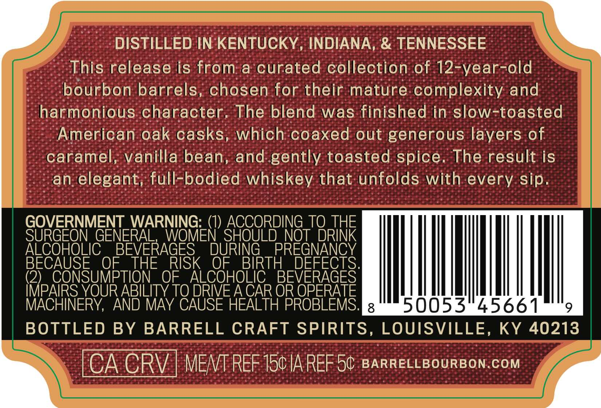
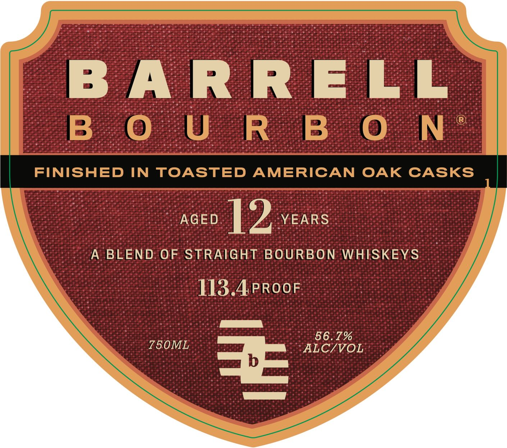
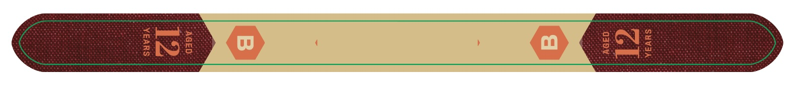

# TTB COLA Label Images - TTBID 26057001000122

**Brand Name:** BARRELL BOURBON

**Issue Date:** 02/27/2026

**Origin Code:** 22

**Product Class/Type:** 121

**Source:** [TTB Public COLA Registry](https://ttbonline.gov/colasonline/viewColaDetails.do?action=publicFormDisplay&ttbid=26057001000122)

## Label Images

### Back Label

### Front Label

### Label 2

## Extracted Label Text

*Text extracted via OCR - may contain errors*

*1 image(s) excluded: text did not meet readability threshold*

**Detected Proof:** 113.4

### Back Label

y DISTILLED IN'KENTUCKY, INDIANA, & TENNESSEE .
e -This release is from:a curated collection of 12-year-old
-; bourbon barrels, chosen-for their mature:complexity and
~harmonious:character. The blend was:finished in slow-toasted
--Amerioan.oak casks, which:coaxed out generous layers of
caramel, vanilla bean, and. gently toasted spice. The result is
- an-elegant, full-bodied whiskey that: unfolds with-every. sip.
GOVERNMENT WARNING: (1) ACCORDING TO THE
SURGEON GENERAL, WOMEN SHOULD _NOT DRINK
ALCOHOLIC. BEVERAGES DURING PREGNANCY
BECAUSE OF _THE RISK OF BIRTH DEFECTS.
(2) CONSUMPTION OF ALCOHOLIC. BEVERAGES
IMPAIRS YOUR ABILITY TO DRIVE A CAR OR OPERATE
MACHINERY, AND MAY CAUSE HEALTH PROBLEMS. [etaaiiod 0) 0 lott fat AlsW 474i Baia
_| BOTTLED BY BARRELL CRAFT SPIRITS, LOUISVILLE, KY 40213 ||
& CA GRV-| MEME REF 15¢ A REF 5¢ :BarReLLeourBoN.com 4

### Front Label

BARRELL

| noeo | D vears :

A BLEND OF STRAIGHT BOURBON WHISKEYS

113.4.PROOF

56.7%

‘ALC/VOL
