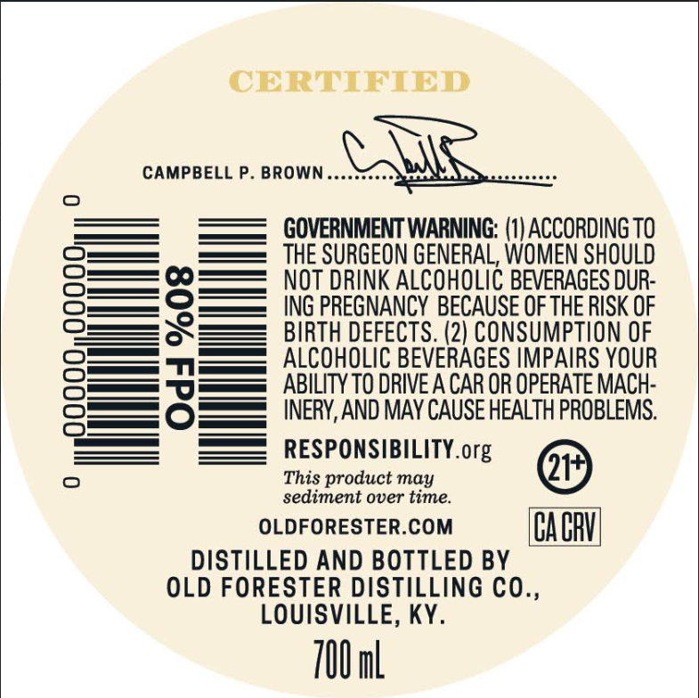
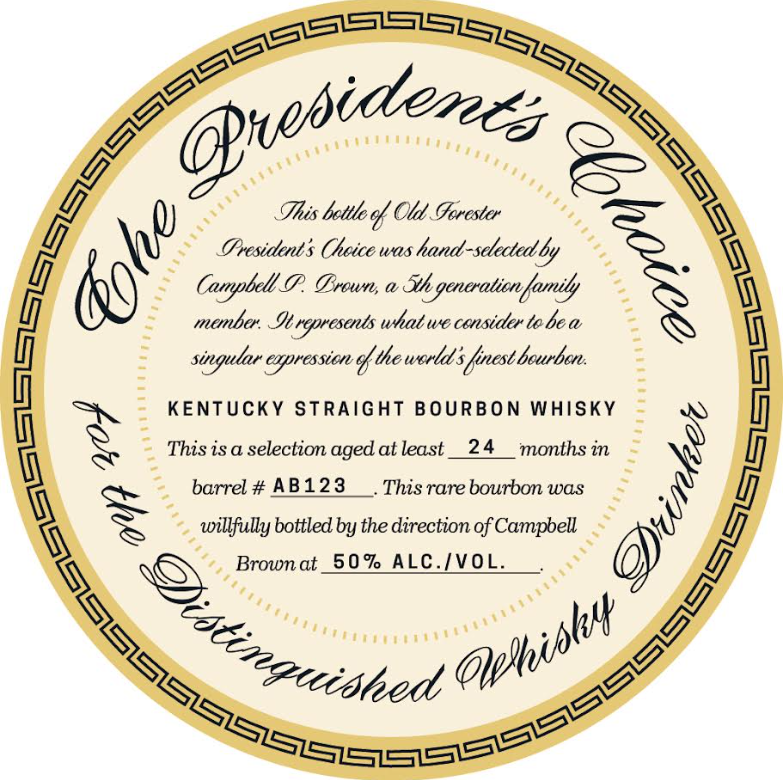
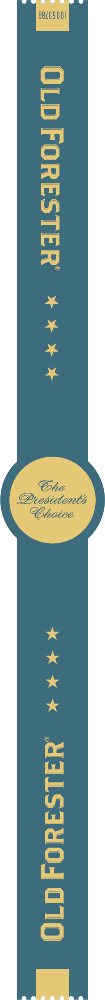

# TTB COLA Label Images - TTBID 26057001000159

**Brand Name:** OLD FORESTER

**Fanciful Name:** THE PRESIDENT'S CHOICE

**Issue Date:** 03/02/2026

**Origin Code:** 22

**Product Class/Type:** 101

**Source:** [TTB Public COLA Registry](https://ttbonline.gov/colasonline/viewColaDetails.do?action=publicFormDisplay&ttbid=26057001000159)

## Label Images

### Back Label

### Front Label

### Label 3

## Extracted Label Text

*Text extracted via OCR - may contain errors*

*1 image(s) excluded: text did not meet readability threshold*

### Back Label

CERTIFIED

GOVERNMENT WARNING: (1) ACCORDING TO
THE SURGEON GENERAL, WOMEN SHOULD
NOT DRINK ALCOHOLIC BEVERAGES DUR-
ING PREGNANCY BECAUSE OF THE RISK OF
BIRTH DEFECTS. (2) CONSUMPTION OF
ALCOHOLIC BEVERAGES IMPAIRS YOUR
ABILITY TO DRIVE A CAR OR OPERATE MACH-
INERY, AND MAY CAUSE HEALTH PROBLEMS.

RESPONSIBILITY. org )
This product may
sediment over time.
OLDFORESTER.COM CACRV
DISTILLED AND BOTTLED BY
OLD FORESTER DISTILLING CO.,
LOUISVILLE, KY.

700ml

### Front Label

This betloof Old Forester
Groesidets Cheice was hand-selected ly

9 = Campbell P. Broun, a He generation family *%

= menbe Ierywesents what we consider tebea
singular expression of the world, finest beurben.

ENTUCKY STRAIGHT BOURBON WHISKY
is is a selection aged at least __24 months in
barrel # AB123 This rare bourbon was

~~ willfully bottled by the direction of Campbell 2

a

‘ty aut®
(brennan)
