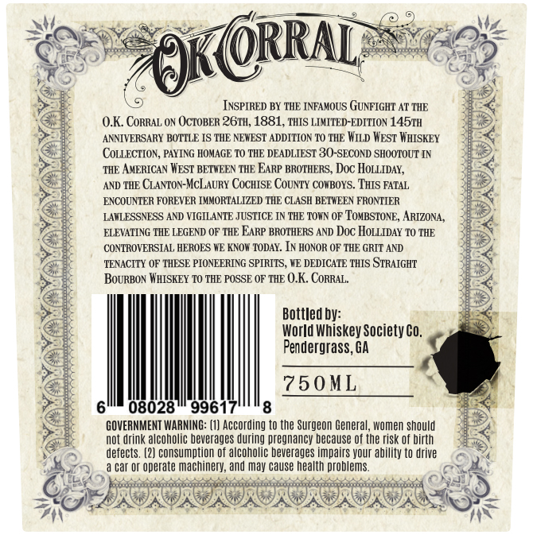
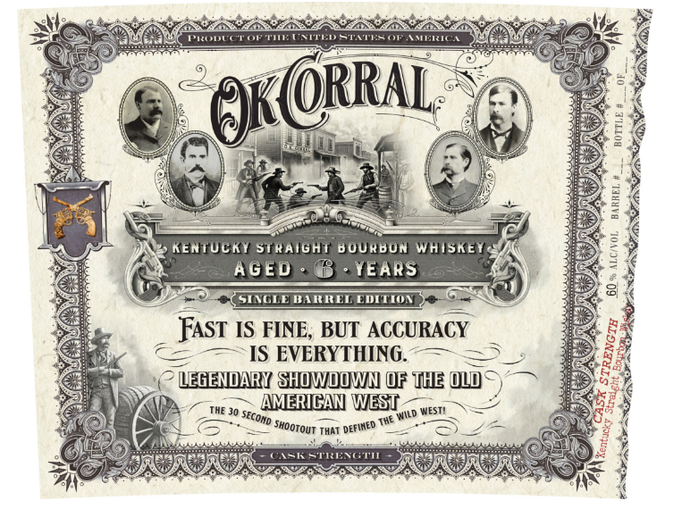

# TTB COLA Label Images - TTBID 26057001000167

**Brand Name:** OK CORRAL

**Issue Date:** 03/02/2026

**Origin Code:** 08

**Product Class/Type:** 101

**Source:** [TTB Public COLA Registry](https://ttbonline.gov/colasonline/viewColaDetails.do?action=publicFormDisplay&ttbid=26057001000167)

## Label Images

### Back Label

### Front Label

## Extracted Label Text

*Text extracted via OCR - may contain errors*

### Back Label

INSPIRED BY THE INFAMOUS GUNFIGHT AT THE
O.K. Conral oN OCTOBER 26TH, 1881, THIS LIMITED-EDITION 1457H
ANNIVERSARY BOTTLE IS THE NEWEST ADDITION TO THE WILD West WHISKEY
‘COLLECTION, PAYING HOMAGE 10 THE DEADLIEST 30-SECOND SHOOTOUT IN
‘THE AMERICAN WEST BETWEEN THE EARP BROTHERS, Doc HOLLIDAY,
AND THE CLANTON-MCLAURY CocHISE COUNTY COWBOYS. THIS FATAL
ENCOUNTER FOREVER INMORTALIZED THE CLASH BETWEEN FRONTIER
LAVLESSNESS AND VIGILANTE JUSTICE IN THE TOWN OF TOMBSTONE, ARIZONA,
ELEVATING THE LEGEND OF THE EARP BROTHERS AND Doc HOLLIDAY 10 THE
CONTROVERSIAL HEROES WE KNOW TODAY. IN HONOR OF THE GRIT AND
‘TENACITY OF THESE PIONEERING SPIRITS, WE DEDICATE THIS STRAIGHT
BouRBON WHISKEY 10 THE POSSE OF THE O.K. CoRRAL,

Bottled by:
World Whiskey Society co,
Pendergrass, GA

750ML
8

08028" 99617

scorune aie (1) According to the Surgeon General, women should
Not drink alcoholic beverages during pregnancy because of the risk of birth
defects. (2) consumption of alcoholic beverages impairs your ability to drive
Caf of operate machinery, and may cause health problems.

### Front Label

Wegssaswanwaataicas eager gellic ¥
or a %
\ ln ae Nerd Wes ome =
2 VO A) eS
St Wy NYP eld) | CEG
a OS ag. 5B (a7) : a

ee) NR AR S.C
[oe Oe
“ww DNS KENTUCKY STRAIGHT BOURBUN WHISKEY« oN ss)
ee 7 AGED = @ -YEARS NG ae
» oa aS (*;
Bess | FAsrT IS FINE, BUT ACCURACY a 55
KS <=} —~IS EVERYTHING. >_> a
2 ESENDARYASHOWOOWNIOESTHEQOUD Sammie © cea
PANO. ncn AUTERIEA WEST ion S| AER

Kol Be mare a vs ais: x
CENA iscsi exmeretrermmes iON. 7
Hi HL. RO RORO NE ee TIT AO MORO LOS i ;

i
