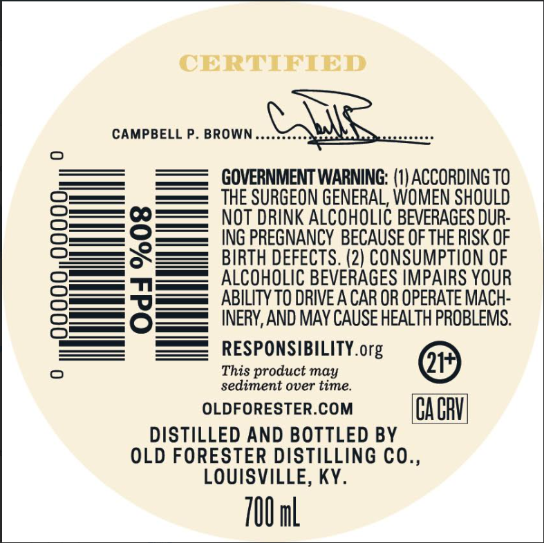
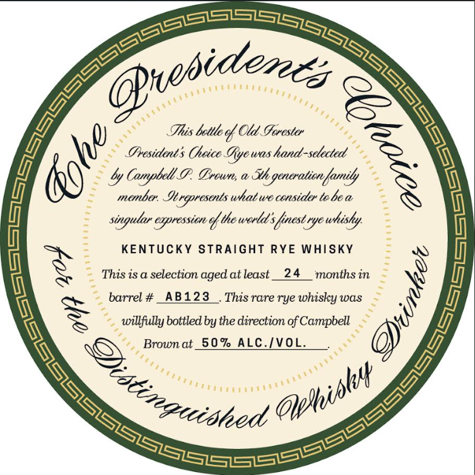

# TTB COLA Label Images - TTBID 26057001000173

**Brand Name:** OLD FORESTER

**Fanciful Name:** THE PRESIDENT'S CHOICE

**Issue Date:** 03/02/2026

**Origin Code:** 22

**Product Class/Type:** 102

**Source:** [TTB Public COLA Registry](https://ttbonline.gov/colasonline/viewColaDetails.do?action=publicFormDisplay&ttbid=26057001000173)

## Label Images

### Back Label

### Front Label

### Label 3

## Extracted Label Text

*Text extracted via OCR - may contain errors*

*1 image(s) excluded: text did not meet readability threshold*

### Back Label

CERTIFIED

CAMPBELL P. BROWN

Perrtrsfen

Perrrtryy

GOVERNMENT WARNING: (1) ACCORDING TO

THE SURGEON GENERAL, WOMEN SHOULD

NOT DRINK ALCOHOLIC BEVERAGES DUR-

ING PREGNANCY BECAUSE OF THE RISK OF

SS

BIRTH DEFECTS. (2) CONSUMPTION OF

== —

ALCOHOLIC BEVERAGES IMPAIRS YOUR

oS 70>

== TN

ABILITY TO DRIVE A CAR OR OPERATE MACH-

=

INERY, AND MAY CAUSE HEALTH PROBLEMS.

s_——

RESPONSIBILITY. org

sediment over time.

This product may

@

OLDFORESTER.COM

CACAY

DISTILLED AND BOTTLED BY

OLD FORESTER DISTILLING CO.,

LOUISVILLE, KY.

700 ml

### Front Label

” heal Ol Gerester

Ny

Presidents Cheice Gye was hand ede

~ &y Campbell P. Brown, a Hh guonejonih

menber eropresents whatwe censider tebe a

singular eapresstete o! ‘he world: Sfinest tye whisty.

=

=

KENTUCKY STRAIGHT RYE WHISKY

~ This is a selection aged at least__24 months in

_ barrel #_AB123 | Thisrare rye whisky was

*,

~ willfully bottled by the direction of ae

Brown at_50% ALC./VOL.

t)

eS

on, a guilt
