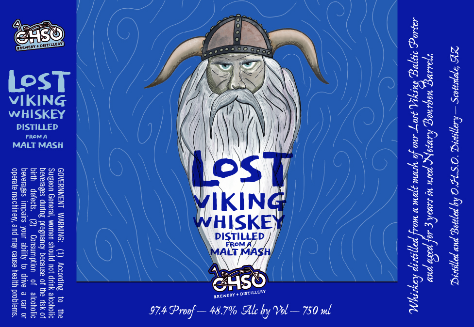

# TTB COLA Label Images - TTBID 26057001000185

**Brand Name:** OHSO

**Fanciful Name:** LOST VIKING

**Issue Date:** 02/27/2026

**Origin Code:** 11

**Product Class/Type:** 140

**Source:** [TTB Public COLA Registry](https://ttbonline.gov/colasonline/viewColaDetails.do?action=publicFormDisplay&ttbid=26057001000185)

## Label Images

### Label 1

## Extracted Label Text

*Text extracted via OCR - may contain errors*

### Label 1

28 oppmes —Kensne, O's 7e O hy ppm pe PAIS

Oe Keopoyye yarn eae
ERTS ER eR peaOd ea

Peep Mey
ULL

Ale by Vol— 750 ul

anewery + DISTILLERY.

974 Proof — 48.7%

\

WHISKEY | |

DISTILLED

FROMA
MALT MASH

bosT
VIKING
