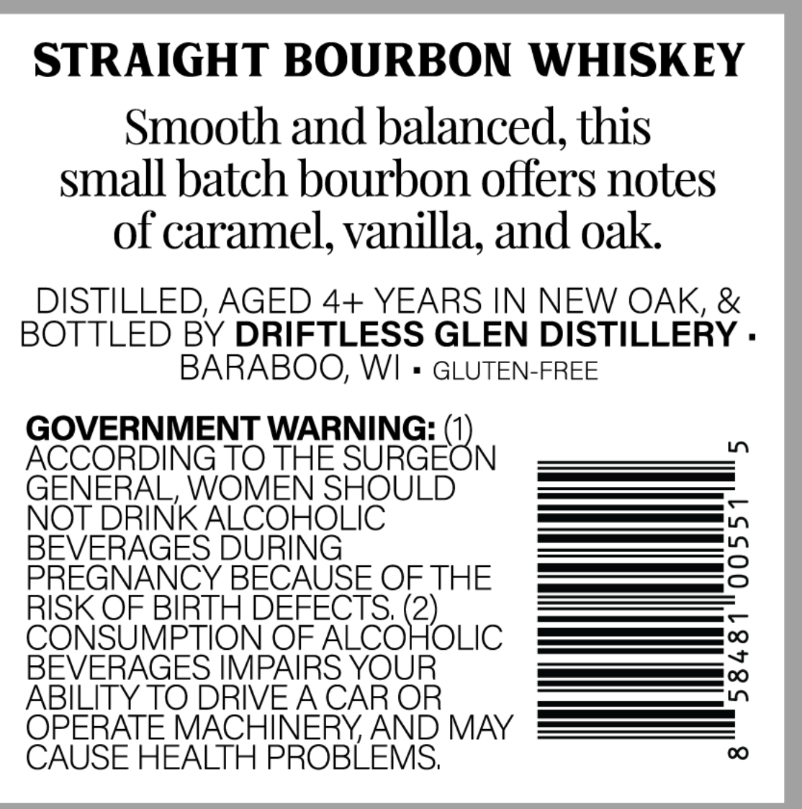
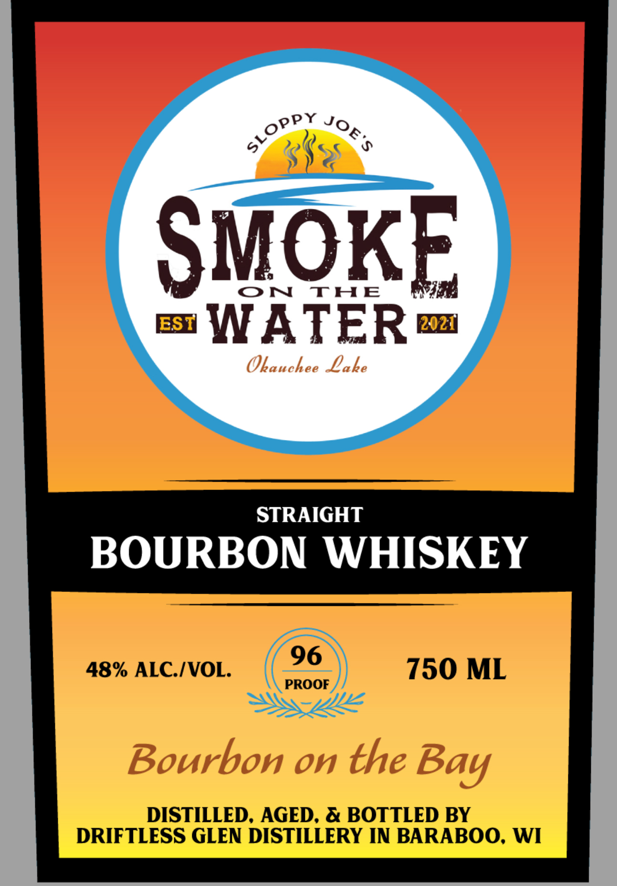

# TTB COLA Label Images - TTBID 26057001000252

**Brand Name:** SMOKE ON THE WATER

**Issue Date:** 03/02/2026

**Origin Code:** 48

**Product Class/Type:** 101

**Source:** [TTB Public COLA Registry](https://ttbonline.gov/colasonline/viewColaDetails.do?action=publicFormDisplay&ttbid=26057001000252)

## Label Images

### Back Label

### Front Label

## Extracted Label Text

*Text extracted via OCR - may contain errors*

### Back Label

STRAIGHT BOURBON WHISKEY

Smooth and balanced, this

small batch bourbon offers notes

of caramel, vanilla, and oak

DISTILLED, AGED 4+ YEARS IN NEW OAK, &

BOTTLED BY DRIFTLESS GLEN DISTILLERY

BARABOO, WI

GLUTEN-FREE

GOVERNMENT WARNING: (

ACCORDING TO THE NURGEC N

GENERAL, WOMEN SHOULD

NOT

INK SBIR

|

es |

EVERAGES D

ee —

PREGNANCY BECAUSE OF THE

— —

RISK OF BIRTH DEF

S. (2)

[—_[ve]

C

|

OF ALCO

OLIC

ABILITY TO DRIV

BEVERAGES IMP,

rr OK)

O

TE

HINERY, AND MAY

CAUSE HEALTH PROBLEMS

### Front Label

SMOKE
si WATER
Okauchee Lake
BOURBON WHISKEY
