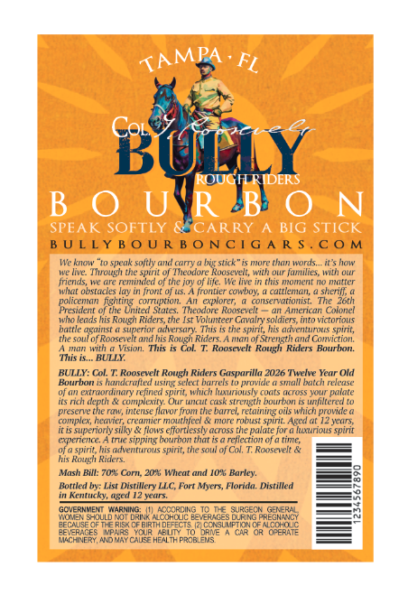
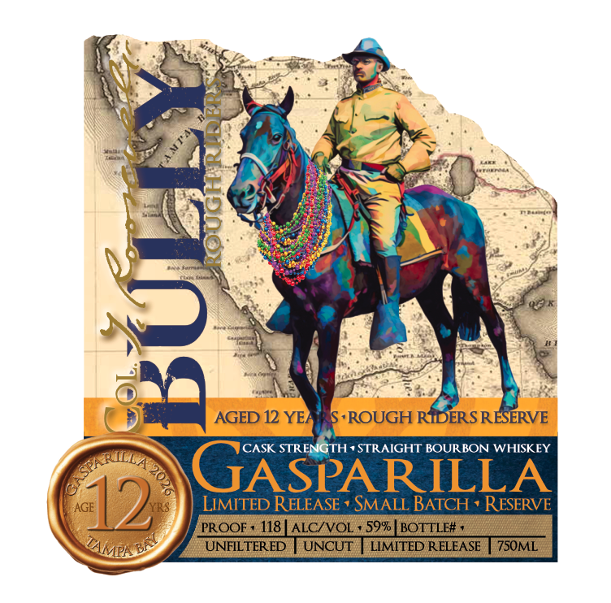
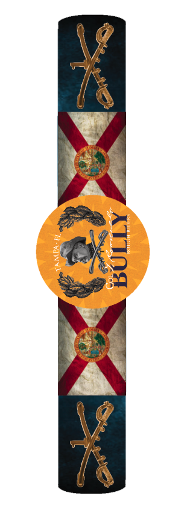

# TTB COLA Label Images - TTBID 26057001000272

**Brand Name:** GASPARILLA

**Issue Date:** 03/09/2026

**Origin Code:** 16

**Product Class/Type:** 101

**Source:** [TTB Public COLA Registry](https://ttbonline.gov/colasonline/viewColaDetails.do?action=publicFormDisplay&ttbid=26057001000272)

## Label Images

### Back Label

### Front Label

### Label 2

## Extracted Label Text

*Text extracted via OCR - may contain errors*

*1 image(s) excluded: text did not meet readability threshold*

**Detected Proof:** 118
**Detected Age:** 12 Years

### Back Label

FL
BULY
B o"HT 8
SPEAK SOFTLY
CARRY A BIG STICK
B U L LY B 0 U R B 0 N C  G A R $ _
C 0 M
We know
speak softly
camy
hig stick"
urTars
its how
Ml IMC
Molutlt' SDITl Ul MlUtltc RuusarL KIlh VlIuclmtilits.MVI ulu
friends; Ive are reminded of the joy
life  We dive in this meoment no matter
Mal Whsa
Cnotcoe
Icunltr ColuN
cled
sheriv;
policeman nghtinG
comta"
explorer;
consetatomisg
Presldent 0f te United States. Tcodor Roosvele
American Cmtonet
wio leads his Rovgh Riders,the Ist Volunteer Cavalry soldiers
KAmnals
battle oganst & superor adversan
Thus
the spnt, his acventuruas splnit;
[lie sou 0  Roosevellara
his Rovgh
man Ol Strength aud Conviction
Uuttn
Vision
This
Col
Roosevell
ROlgl
Kiders
Raumion
Tis is  BULLY:
BULIY: Col
Roneeuelt
Riders Gasprilla 2026 Twvelve Year Old
buuruun
hionelctaled MSUITE seltch Dturfels
provicle & SWRaall batch release
extraordinary refined spirit; which fuxurionsly
KWd
Feu
palate
noidenl
CTAEEE
Our MGu Guse snueth huurir
unlenx
presene the raw; intense Jlavor Jront the bamrel; retairag oils which provide @
compic hemrer
crecuuer mnouthteel
mor rbust spirit Agcd ut 12years;
ic is superionly silky
flows effortlessly across the palate for a ltsurious spirt
enenence .
Me SIDDIME Otumon MankS 0 rerectlo O0 (inte
ofa spirit, his adveetTrous spirit, tle soul of Col,
Raoeeit
his Rowgh
Knen
Mash Bill: XU
Coni_
Incat and IU"L
Burcv_
Bottled by: List Distillery LLC; Fort Myers, Florida: Distilled
Kentucky, aged 12 years
GOVERN MENT
Barwer NA Oorrole_Veraces GursegpReeNercy
@ecaeseqould RoT [
CfMccki
EXRTARECo eoete
GERT
Recfaxces Nomay
CAVse HEALTR PROBIZMS
TAMPA
Pidem
LTa
Rougu
T#

### Front Label

3
AGED 12 YER
S,ROUGH RIDERS RESERVE
CASK STRENGTH , STRAIGHT BOUR BON WHISKEY
UASPARILLA
AGE
12
LIMITED RELEASE
SMALL BATCH v RESERVE
PROQF
118
ALC/VOL
59% | BOTTLE#
UNFILTERED
UNCUT
LIMITED RELEASE
7SOML
CA 202
"BAY
TAMPN
