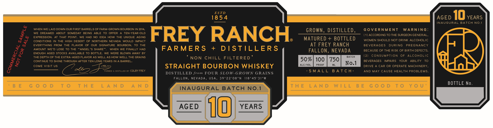

# TTB COLA Label Images - TTBID 26057001000418

**Brand Name:** FREY RANCH FARMERS + DISTILLERS

**Issue Date:** 03/05/2026

**Origin Code:** 32

**Product Class/Type:** 101

**Source:** [TTB Public COLA Registry](https://ttbonline.gov/colasonline/viewColaDetails.do?action=publicFormDisplay&ttbid=26057001000418)

## Label Images

### Label 1

## Extracted Label Text

*Text extracted via OCR - may contain errors*

**Detected Proof:** 100
**Detected Age:** 10 Years

### Label 1

ES TD
18 5 4
AGED
10 YEARS
INAUGURAL BATCH NO.1
WHEN WE LAID DOWN OUR FIRST BARRELS OF FARM-GROWN BOURBON IN 2014,
GROWN,
DISTILLED,
GoVERNMENT
WARNiNG:
WE DREAMED ABOUT SOMEDAY BEING
ABLE TO OFFER
A
TEN-YEAR-OLD
FREY RANCH
(1) ACCORDING TO THE SURGEON GENERAL,
EXPRESSION:
AT THAT
POINT, WE
HAD
NO IDEA HOW THE UNIQUE AGING
MATURED +
BOTTLED
CONDITIONS IN THE HIGH DESERT OF NORTHERN NEVADA WOULD
IMPACT
WOMEN SHOULD NOT DRINK ALCOHOLIC
EVERYTHING FROM
THE
FLAVOR
OF
OUR   SIGNATURE
BOURBON,
TO
THE
AT FREY RANCH
BEVERAGES
DURING
PREGNANCY
AMOUNT WE'D LOSE TO THE "ANGEL'S SHARE
WHEN WE FINALLY HAD
FARMER S
+
DIS TILLER S
FALLON, NEVADA
BECAUSE OF THE RISK OF BIRTH DEFECTS:
ENOUGH AGED STOCKS AVAILABLE TO BOTTLE
WE WERE BLOWN AWAY BY
THE DEPTH OF THE EXTRA-AGED FLAVOR AS WELL AS HOW WELL THE GRAINS
NON
CHILL
FILTERED
BATCH
(2)
CONSUMPTION
OF
ALCOHOLIC
CONTINUE TO SHINE THROUGH AFTER TEN LONG YEARS IN A BARREL_
50%
100
750
BEVERAGES
IMPAIRS
YOUR
ABILITY
TO
COME ViSiT US
2
STRAIGHT BOURBON WHISKEY
ALC/VOL
PROOF
ML
No.1
DRIVE
A CAR OR OPERATE MACHINERY,
FARMED
DISTILLED BY COLBY FREY
S MALL
B A T C H-
AND MAY CAUSE HEALTH PROBLEMS.
DISTILLED
from FOUR SLOW-GROWN GRAINS
FALLON, NEVADA, USA, 39022'08"N
118 o 45' 31"W
BOTTLE No.
B E
G 0 0 D
T 0
T H E
L A N D
A N D
T H E
L A N D
W | LL B E
G 0 0 D
T 0
Y 0 U '
INAUGURAL
BATCH
NO.1
AGED
i0
YEARS
3
3
I
8
9
