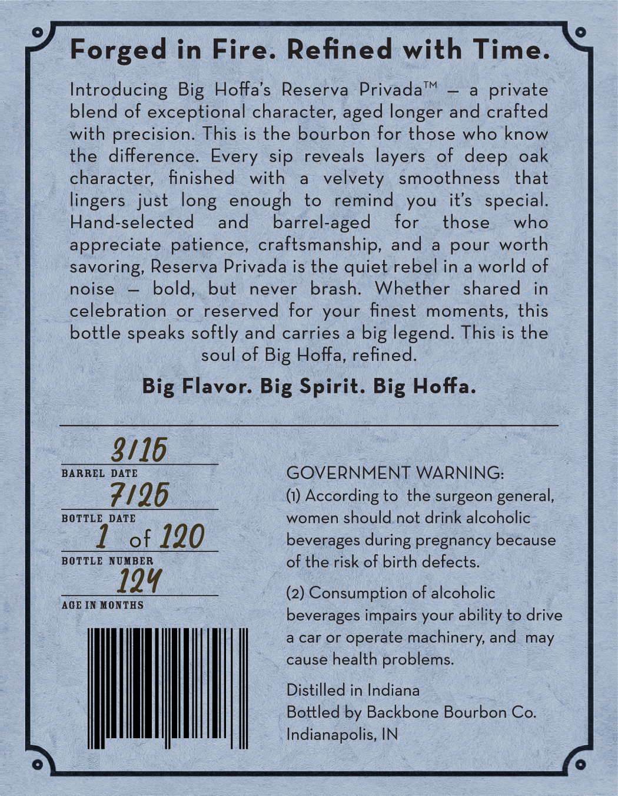
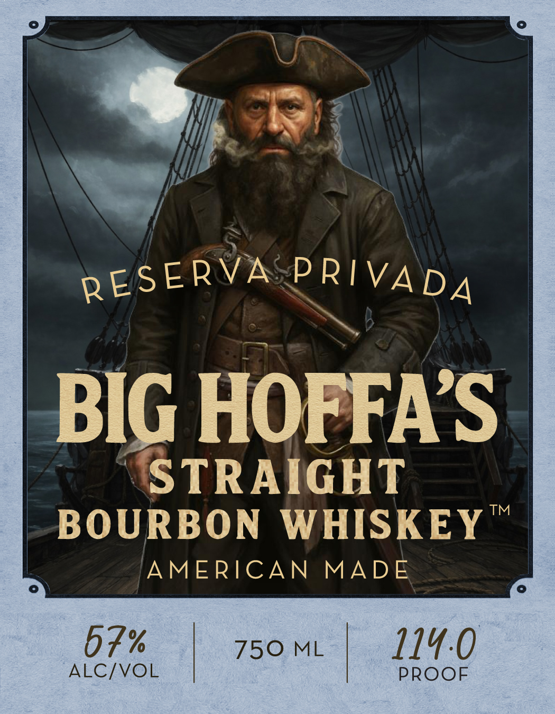

# TTB COLA Label Images - TTBID 26057001000469

**Brand Name:** BIG HOFFA'S STRAIGHT BOURBON WHISKEY

**Issue Date:** 02/27/2026

**Origin Code:** 19

**Product Class/Type:** 101

**Source:** [TTB Public COLA Registry](https://ttbonline.gov/colasonline/viewColaDetails.do?action=publicFormDisplay&ttbid=26057001000469)

## Label Images

### Back Label

### Front Label

## Extracted Label Text

*Text extracted via OCR - may contain errors*

### Back Label

Forged in Fire. Refined with Time.

Introducing Big Hoffa’s Reserva Privada™ — a private
blend of exceptional character, aged longer and crafted
with precision. This is the bourbon for those who know
the difference. Every sip reveals layers of deep oak
character, finished with a velvety smoothness that
lingers just long enough to remind you it’s special.
Hand-selected and barrel-aged for those who
appreciate patience, craftsmanship, and a pour worth
savoring, Reserva Privada is the quiet rebel in a world of
noise — bold, but never brash. Whether shared in
celebration or reserved for your finest moments, this
bottle speaks softly and carries a big legend. This is the
soul of Big Hoffa, refined.

Big Flavor. Big Spirit. Big Hoffa.

3/16

BARREL DATE GOVERNMENT WARNING:
7/96 (1) According to the surgeon general,
BOTTLE DATE women should not drink alcoholic

of 120 beverages during pregnancy because
BOTTLE NUMBER of the risk of birth defects.

(2) Consumption of alcoholic
beverages impairs your ability to drive

a car or operate machinery, and may
cause health problems.

Distilled in Indiana

Bottled by Backbone Bourbon Co.
Indianapolis, IN

AGE IN MONTHS

### Front Label

S-

wy QEIVAD A

BIG HOFFA’S.

BOURBON WHISKEY

‘STRAIGHT

AMERICAN MADE

7% | 50 ML

114.0
