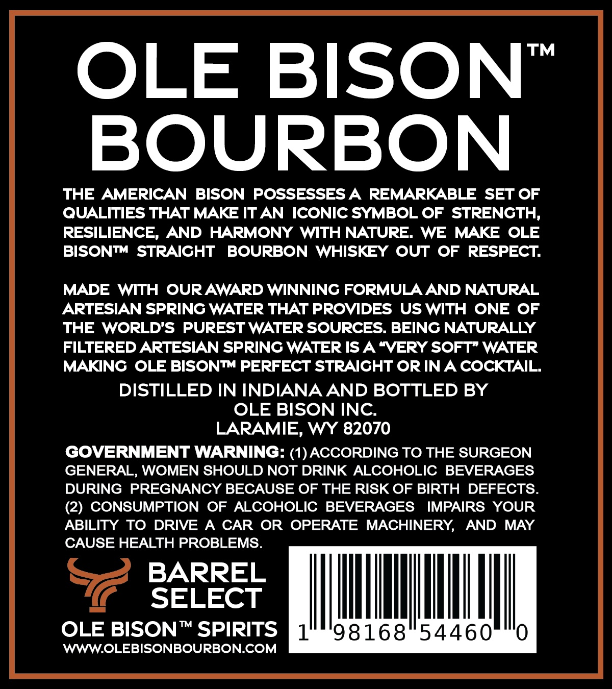
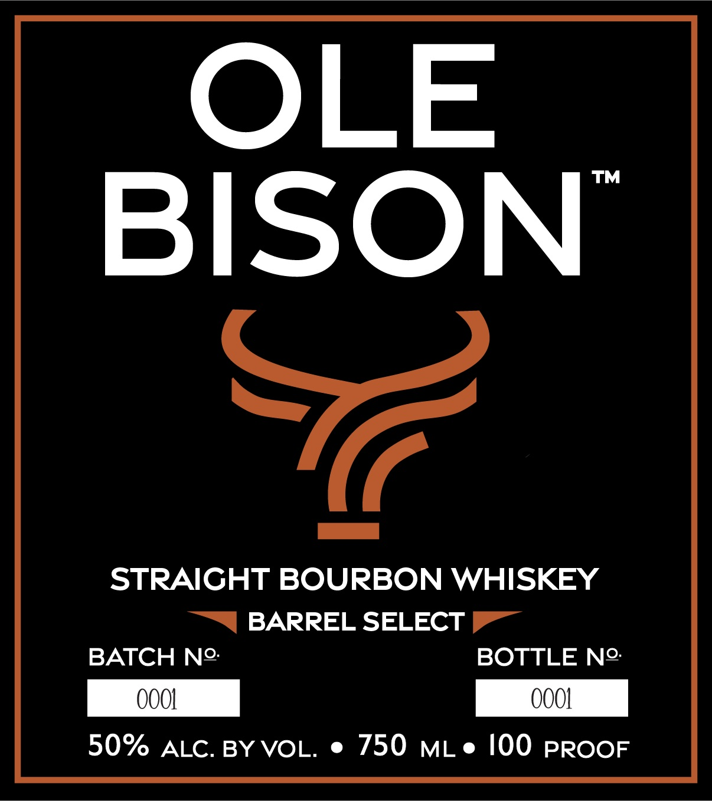

# TTB COLA Label Images - TTBID 26057001000486

**Brand Name:** OLE BISON

**Issue Date:** 02/27/2026

**Origin Code:** 49

**Product Class/Type:** 101

**Source:** [TTB Public COLA Registry](https://ttbonline.gov/colasonline/viewColaDetails.do?action=publicFormDisplay&ttbid=26057001000486)

## Label Images

### Back Label

### Front Label

## Extracted Label Text

*Text extracted via OCR - may contain errors*

**Detected Proof:** 100

### Back Label

OLE BISON"

BOURBON

THE AMERICAN BISON POSSESSES A REMARKABLE SET OF

QUALITIES THAT MAKE IT AN ICONIC SYMBOL OF STRENGTH

RESILIENCE, AND HARMONY WITH NATURE. WE MAKE OLE

BISON™ STRAIGHT BOURBON WHISKEY OUT OF RESPECT.

MADE WITH OUR AWARD WINNING FORMULA AND NATURAL

ARTESIAN SPRING WATER THAT PROVIDES US WITH ONE OF

THE WORLD’S PUREST WATER SOURCES. BEING NATURALLY

FILTERED ARTESIAN SPRING WATER IS A “VERY SOFT” WATER

MAKING OLE BISON™ PERFECT STRAIGHT OR IN A COCKTAIL.

DISTILLED IN INDIANA AND BOTTLED BY

OLE BISON INC.

LARAMIE, WY 82070

GOVERNMENT WARNING: (1) ACCORDING TO THE SURGEON

GENERAL, WOMEN SHOULD NOT DRINK ALCOHOLIC BEVERAGES

DURING PREGNANCY BECAUSE OF THE RISK OF BIRTH DEFECTS

(2) CONSUMPTION OF ALCOHOLIC BEVERAGES IMPAIRS YOUR

ABILITY TO DRIVE A en OR OPERATE MACHINERY, AND MAY

USE HEALTH PROBLEM

BARREL

a

SELECT

SON™ SPIRIT:

1

98168 54460

0

WWW.OLEBISONBOURBON.COM

### Front Label

OLE

BISON

Ka

STRAIGHT BOURBON WHISKEY

“S| BARREL SELECT

BATCH N2:

BOTTLE N2

50% ALC. BY VOL. e 750 mLe 100 proor
