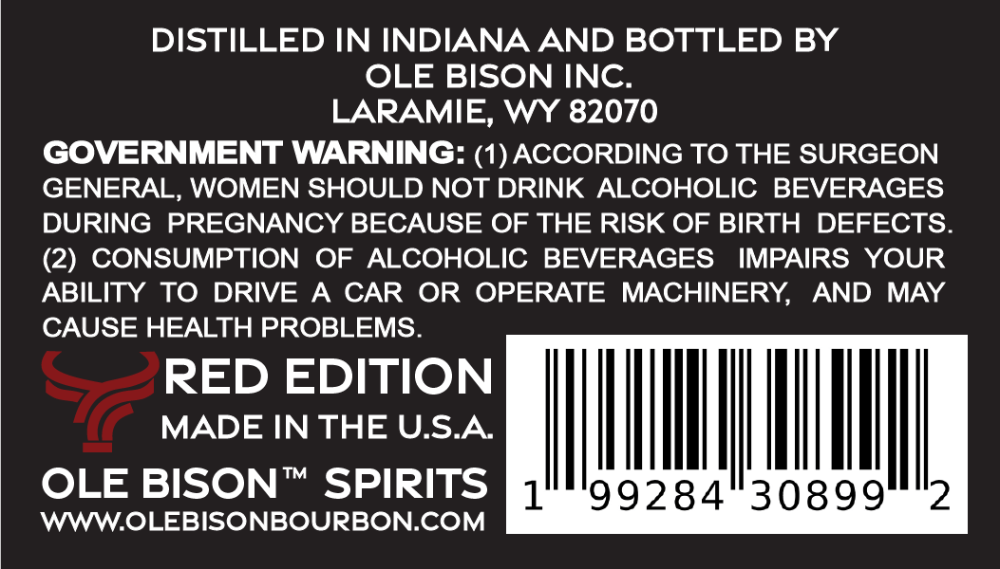
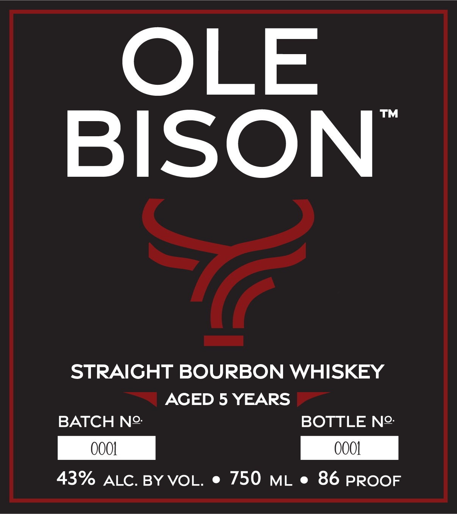

# TTB COLA Label Images - TTBID 26057001000504

**Brand Name:** OLE BISON

**Issue Date:** 02/27/2026

**Origin Code:** 49

**Product Class/Type:** 101

**Source:** [TTB Public COLA Registry](https://ttbonline.gov/colasonline/viewColaDetails.do?action=publicFormDisplay&ttbid=26057001000504)

## Label Images

### Back Label

### Front Label

## Extracted Label Text

*Text extracted via OCR - may contain errors*

**Detected Proof:** 86
**Detected Age:** 5 Years

### Back Label

DISTILLED IN INDIANA AND BOTTLED BY

OLE BISON INC

LARAMIE, WY 82070

GOVERNMENT WARNING: (1) ACCORDING TO THE SURGEON

GENERAL, WOMEN SHOULD NOT DRINK ALCOHOLIC BEVERAGES

DURING PREGNANCY BECAUSE OF THE RISK OF BIRTH DEFECTS

(2) CONSUMPTION OF ALCOHOLIC BEVERAGES IMPAIRS YOUR

ABILITY TO DRIVE A CAR OR OPERATE MACHINERY, AND MAY

CAUSE HEALTH PROBLEMS

RED EDITION

MADE IN THE U.S.A.

|

|

|

|

it

WWW.OLEBISONBOURBON.COM

OLE BISON™ SPIRITS if

99284 30899

### Front Label

OLE

BISON’

STRAIGHT BOURBON WHISKEY

AGED 5 YEARS ©

BATCH N2:

BOTTLE N2:

43% ALC. BY VOL. e 750 mL e 86 PROOF
