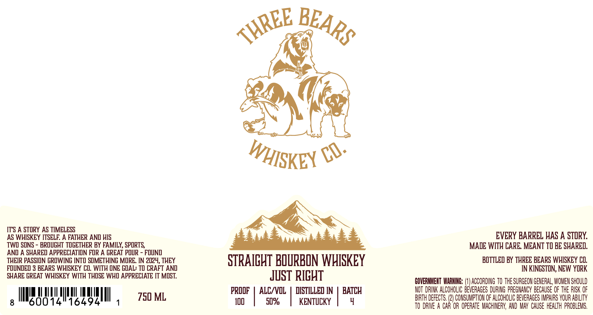

# TTB COLA Label Images - TTBID 26057001000594

**Brand Name:** THREE BEARS WHISKEY CO.

**Issue Date:** 03/02/2026

**Origin Code:** 02

**Product Class/Type:** 101

**Source:** [TTB Public COLA Registry](https://ttbonline.gov/colasonline/viewColaDetails.do?action=publicFormDisplay&ttbid=26057001000594)

## Label Images

### Label 1

### Label 2

## Extracted Label Text

*Text extracted via OCR - may contain errors*

*1 image(s) excluded: text did not meet readability threshold*

**Detected Proof:** 100

### Label 1

ITS A STORY AS TIMELESS

AS WHISKEY ITSELF. A FATHER AND HIS

TWO SONS - BROUGHT TOGETHER BY FAMILY, SPORTS,

ANID A SHARED APPRECIATION FOR A GREAT POUR - FOUND
THEIR PASSION GROWING INTO SOMETHING MORE. IN 2024, THEY
FOUNDED 3 BEARS WHISKEY CO. WITH ONE GOAL: TO CRAFT AND
SHARE GREAT WHISKEY WITH THOSE WHO APPRECIATE IT MOST.

AT so

STRAIGHT BOURBON WHISKEY

PROOF
100

| A

JUST RIGHT

LC/VOL
50%

DISTILLED IN | BATCH

KENTUCKY

q

EVERY BARREL HAS A STORY.
MADE WITH CARE. MEANT TO BE SHARED.

BOTTLED BY THREE BEARS WHISKEY CO.
IN KINGSTON, NEW YORK

GOVERNMENT WARNING: (1) ACCORDING TO THE SURGEON GENERAL, WOMEN SHOULD
NOT DRINK ALCOHOLIC BEVERAGES DURING PREGNANCY BECAUSE OF THE RISK OF
BIRTH DEFECTS. f) CONSUMPTION OF ALCOHOLIC BEVERAGES IMPAIRS YOUR ABILITY
TO DRIVE A CAR OR OPERATE MACHINERY, AND MAY CAUSE HEALTH PROBLEMS.
