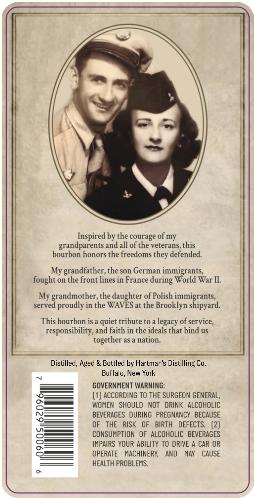
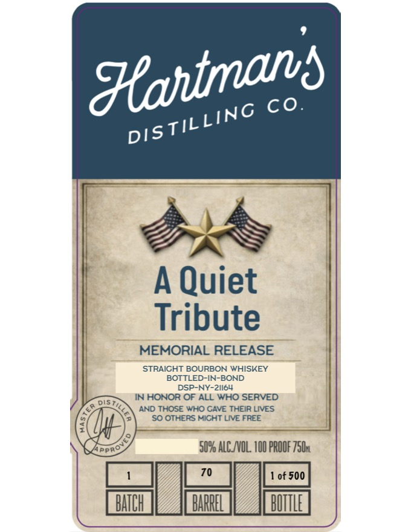
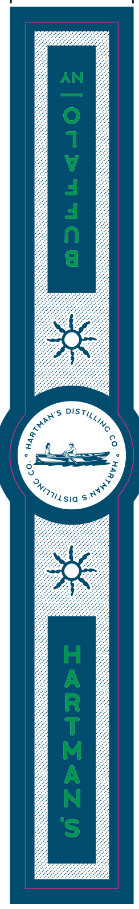

# TTB COLA Label Images - TTBID 26057001000651

**Brand Name:** HARTMAN'S DISTILLING CO.

**Fanciful Name:** A QUIET TRIBUTE

**Issue Date:** 03/03/2026

**Origin Code:** 02

**Product Class/Type:** 101

**Source:** [TTB Public COLA Registry](https://ttbonline.gov/colasonline/viewColaDetails.do?action=publicFormDisplay&ttbid=26057001000651)

## Label Images

### Back Label

### Front Label

### Label 2

## Extracted Label Text

*Text extracted via OCR - may contain errors*

*1 image(s) excluded: text did not meet readability threshold*

**Detected Proof:** 100

### Back Label

Inspired by the courage of my
grandparents and all of the veterans, this
bourbon honors the freedoms they defended.

My grandfather, the son German immigrants,
fought on the front lines in France during World War IL.

My grandmother, the daughter of Polish immigrants,
served proudly in the WAVES at the Brooklyn shipyard.

This bourbon is a quiet tribute to a legacy of service,
responsibility, and faith in the ideals that bind us
together as a nation.

Distilled, Aged & Bottled by Hartman's Distilling Co.
Buffalo, New York

GOVERNMENT WARNING:

(1) ACCORDING TO THE SURGEON GENERAL,
WOMEN SHOULD NOT DRINK ALCOHOLIC
BEVERAGES DURING PREGNANCY BECAUSE
OF THE RISK OF BIRTH DEFECTS. (2)
CONSUMPTION OF ALCOHOLIC BEVERAGES
IMPAIRS YOUR ABILITY TO DRIVE A CAR OR
OPERATE MACHINERY, AND MAY CAUSE
HEALTH PROBLEMS.

### Front Label

SSE

A Quiet
Tribute

MEMORIAL RELEASE

STRAIGHT BOURBON WHISKEY
BOTTLED-IN-BOND
DSP-NY-21I64
IN HONOR OF ALL WHO SERVED
AND THOSE WHO CAVE THEIR LIVES,
‘SO OTHERS MIGHT LIVE FREE

50% ALC/VOL. 100 PROOF 750s
