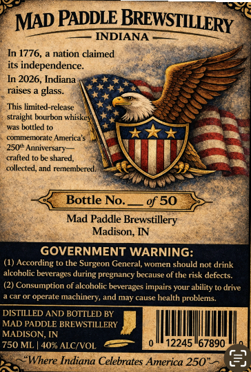
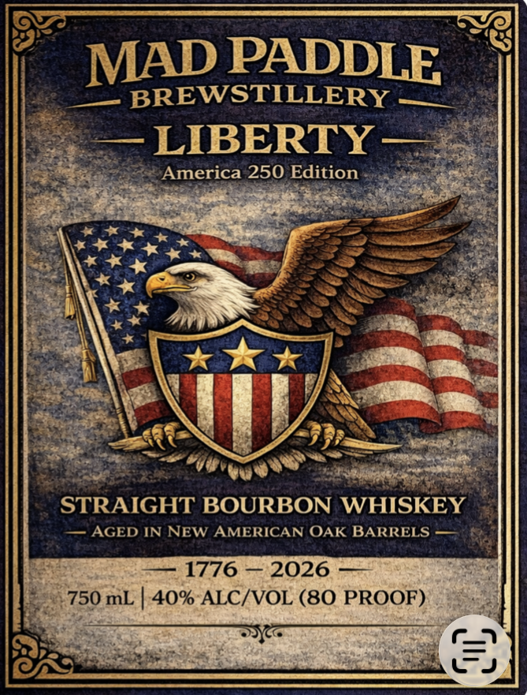

# TTB COLA Label Images - TTBID 26057001000734

**Brand Name:** MAD PADDLE BREWSTILLERY

**Issue Date:** 04/10/2026

**Origin Code:** 19

**Product Class/Type:** 101

**Source:** [TTB Public COLA Registry](https://ttbonline.gov/colasonline/viewColaDetails.do?action=publicFormDisplay&ttbid=26057001000734)

## Label Images

### Back Label

### Front Label

## Extracted Label Text

*Text extracted via OCR - may contain errors*

*1 image(s) excluded: text did not meet readability threshold*

**Detected Proof:** 80

### Back Label

MAD PADDLE BREWSTILLERY
INDIANA
In 1776,
nation claimed
its independence
In 2026, Indiana
raises
glass:
This limited-release
straight burbon whiske
was boltled
commemorate America'$
250th Anniversary
crafted
be shared,
collexted, and
renemnneted
Bottle No:
of 50
Mad Paddle Brewstillery
Madison, IN
GOVERNMENT WARNING:
According
to tnt
Surgeon General, women should not drink
alcoholic beverages
pregnancy
because of the risk defects
(2) Consumption of alcoholic beverages impairs your ability
drive
ppcnale
machinery, and
may cause health
problems.
DISTILLED
BOTTLED BY
MAD PADDLE BREWSTILLERY
MADISON, IN
750 ML
40% ALCIVOL
12245"67890
Where Indiana Celebrates America 250"
during !
AND
