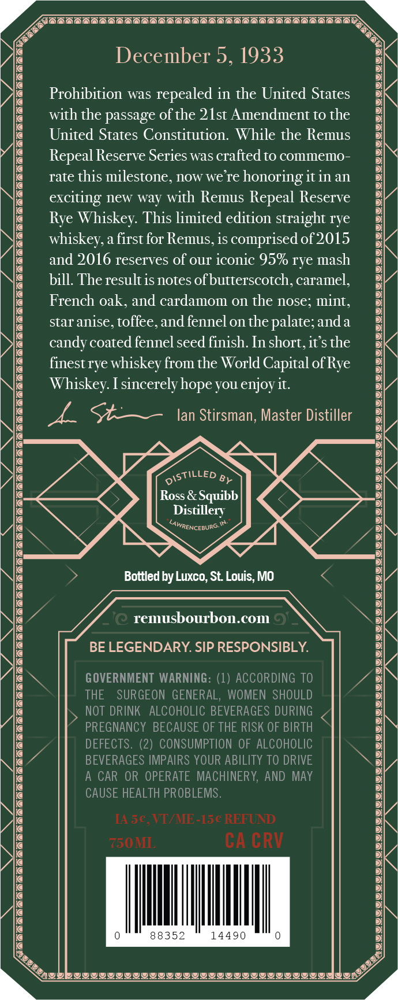
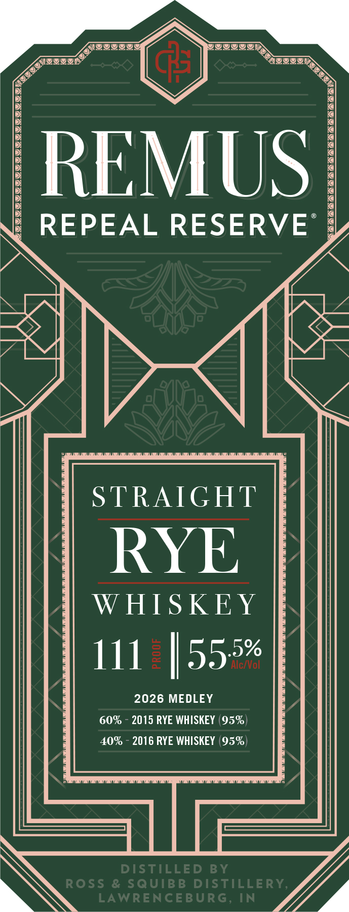

# TTB COLA Label Images - TTBID 26057001000751

**Brand Name:** REMUS

**Issue Date:** 03/02/2026

**Origin Code:** 29

**Product Class/Type:** 102

**Source:** [TTB Public COLA Registry](https://ttbonline.gov/colasonline/viewColaDetails.do?action=publicFormDisplay&ttbid=26057001000751)

## Label Images

### Back Label

### Front Label

### Label 3

## Extracted Label Text

*Text extracted via OCR - may contain errors*

### Back Label

LT VC VV TT TV VCR VV VT TT TN TNO

A

December 5, 1933

Prohibition was repealed in the United States
with the passage of the 21st Amendment to the
United States Constitution. While the Remus
Repeal Reserve Series was crafted to commemo-
rate this milestone, now we're honoring it in an
exciting new way with Remus Repeal Reserve
Rye Whiskey. This limited edition straight rye
whiskey, a first for Remus, is comprised of 2015
and 2016 reserves of our iconic 95% rye mash
bill. The result is notes of butterscotch, caramel,

French oak, and cardamom on the nose; mint,
star anise, toffee, and fennel on the palate; anda
candy coated fennel seed finish. In short, it’s the
finest rye whiskey from the World Capital of Rye
Whiskey. I sincerely hope you enjoy it.

I, S+— an Stirsman, Master Distiller

GISTILLED @
Ross & Squibb
Distillery

“Abmpenceaune™

> Bottled by Luxco, St. Louis, MO K

remusbourbon.com

BE LEGENDARY. SIP RESPONSIBLY.

THE SURGEON GENERAL, WOMEN SHOULD
NOT DRINK ALCOHOLIC BEVERAGES DURING
PREGNANCY BECAUSE OF THE RISK OF BIRTH
DEFECTS. (2) CONSUMPTION OF ALCOHOLIC
BEVERAGES IMPAIRS YOUR ABILITY TO DRIVE
A CAR OR OPERATE MACHINERY, AND MAY
CAUSE HEALTH PROBLEMS.

[A5¢€, VI/ME-15¢ REFUND

730 MI CACRV

14490

YIIIVIIYIIYLIOIIOVIOIIIOIIOII OAs oy

; <
Ze
Ag
lq
ke

~~

MB nn
Ze

va

GOVERNMENT WARNING: (1) ACCORDING TO vA

Yo

Qe

Y

IYI YIIY YOY YY YOY IYIY IYO Y UWI VIII YG YU OYY YI YOY YY IYI YG YOY YOGI YOY YOY YOOVYoowwy

TA

### Front Label

MU

' REPEAL RESERVE :

LN

WWI

IM

» . we

WMAIGNT

RYE

WHISKEY

111 | ae

2026 MEDLEY

Vy

### Label 3

PR cS OR KS ON RE OR CRS ER ES ET Ge BP cs RE
REPEAL || RY [|] series
PRR gE RES RR gS BES OEE RON EGY RAS REN PSE PS RR ON BF Ge ON
