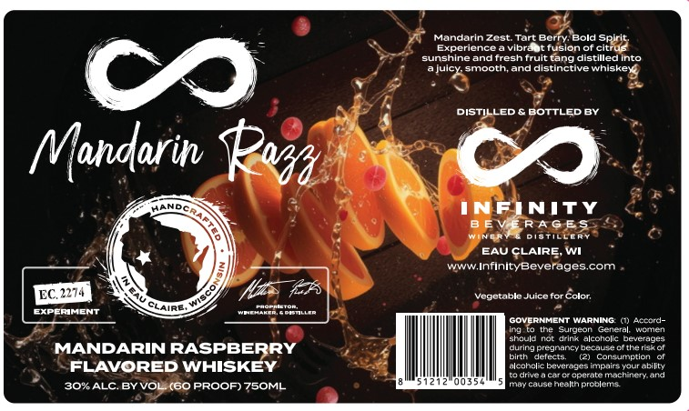

# TTB COLA Label Images - TTBID 26058001000122

**Brand Name:** HANDCRAFTED

**Issue Date:** 03/06/2026

**Origin Code:** 48

**Product Class/Type:** 149

**Source:** [TTB Public COLA Registry](https://ttbonline.gov/colasonline/viewColaDetails.do?action=publicFormDisplay&ttbid=26058001000122)

## Label Images

### Front Label

## Extracted Label Text

*Text extracted via OCR - may contain errors*

**Detected Proof:** 120

### Front Label

Mandarin Zest: Tart Berry: Bold Spirit;
Experience
ibr_
fusion of citrus
sunshineandfresh fruit tang distilledinto
auicy smooun
and distinctive
Wnisker
C
DISTILLED
BOTTLEDBY
Mandarin
INFINITY
B E
RAG19
EAU CLAIRE'
WI
www InfinltyBeveragescom
EC. 2274
2f
VgobtabibJuicbtor
Color;
EIDERINENT
Enn
GOVERNMENT WARNING
() Accord-
Burdeon
General
ulamen
shaull
rot Jrink
alcoholic
bevenaoe
MANDARIN RASPBERRY
Ducit
Dteanan
Jeca
thetal
birth
deleci
conaumption
FLAVORED WHISKEY
alcaheli beyerales impaing YJuratiil
@mi
Jperale Machaneryand
003
Causeheall Dicblemg
30#ALC BYVOL (60 PROOF) 75OML
Pofa
GLAIAT
