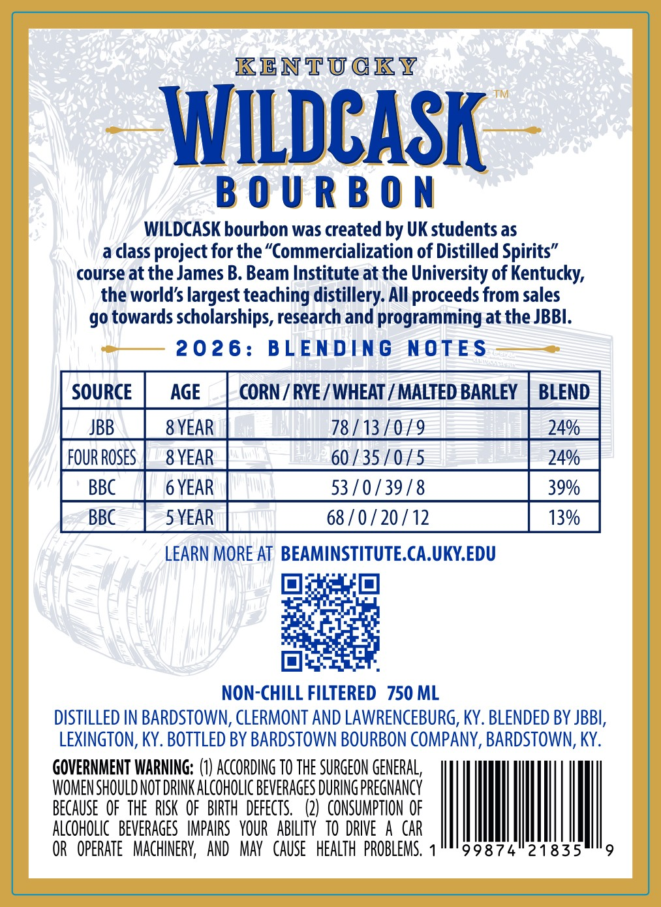
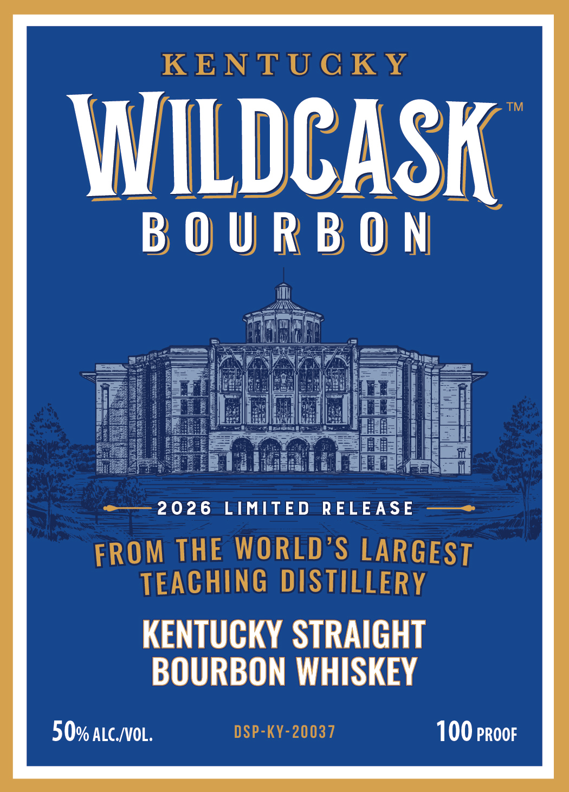
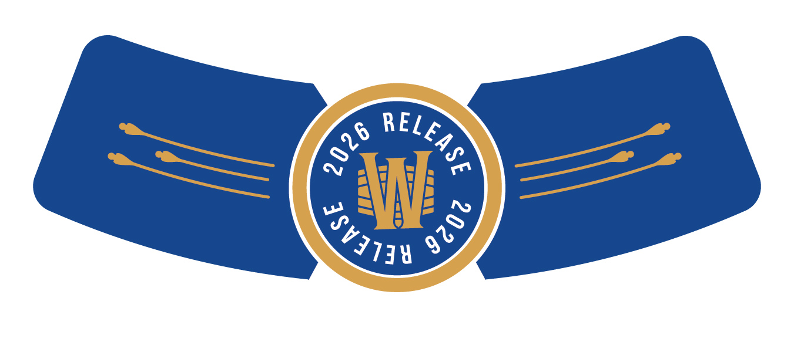

# TTB COLA Label Images - TTBID 26058001000141

**Brand Name:** KENTUCKY WILDCASK

**Issue Date:** 03/02/2026

**Origin Code:** 22

**Product Class/Type:** 101

**Source:** [TTB Public COLA Registry](https://ttbonline.gov/colasonline/viewColaDetails.do?action=publicFormDisplay&ttbid=26058001000141)

## Label Images

### Back Label

### Front Label

### Label 2

## Extracted Label Text

*Text extracted via OCR - may contain errors*

*1 image(s) excluded: text did not meet readability threshold*

### Back Label

KENTUCKY

WILDCASK

WILDCASK bourbon was created by UK students as
a class project for the “Commercialization of Distilled Spirits”
course at the James B. Beam Institute at the University of Kentucky,
the world’s largest teaching distillery. All proceeds from sales
go towards scholarships, research and programming at the JBBI.

2026: BLENDING NOTES

[source | AGE _| CORN/RYE/WHEAT/ MALTED BARLEY | BLEND |

FOURROSES | _8YEAR 60/35 /0/5

BBC | GYEAR 53/0/39/8

LEARN MORE AT BEAMINSTITUTE.CA.UKY.EDU
oc

Ops
NON-CHILL FILTERED 750 ML

DISTILLED IN BARDSTOWN, CLERMONT AND LAWRENCEBURG, KY. BLENDED BY JBBI,
LEXINGTON, KY. BOTTLED BY BARDSTOWN BOURBON COMPANY, BARDSTOWN, KY.

GOVERNMENT WARNING: (1) ACCORDING TO THE SURGEON GENERAL,
WOMEN SHOULD NOT DRINK ALCOHOLIC BEVERAGES DURING PREGNANCY
BECAUSE OF THE RISK OF BIRTH DEFECTS. (2) CONSUMPTION OF
ALCOHOLIC BEVERAGES IMPAIRS YOUR ABILITY TO DRIVE A CAR
OR OPERATE MACHINERY, AND MAY CAUSE HEALTH PROBLEMS. 1°°'99874°21835" 9

### Front Label

Wee a wee ceca Te | esa
A Minbe salt
2026 LIMITED RELEASE
KENTUCKY STRAIGHT
BOURBON WHISKEY
50% atc/voL. 100 proor
