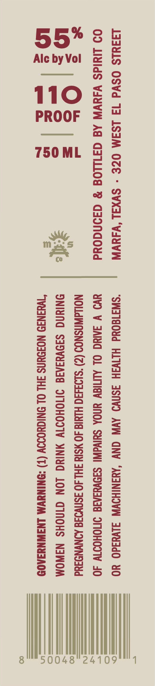
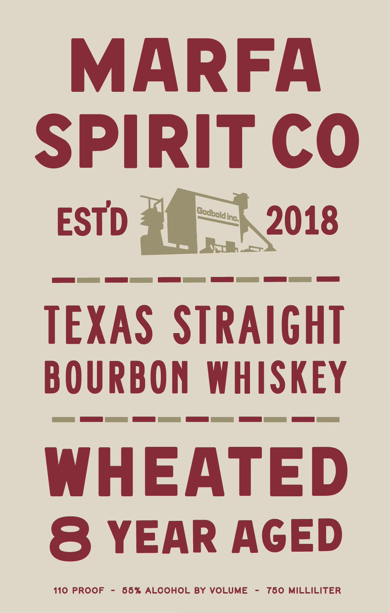

# TTB COLA Label Images - TTBID 26058001000272

**Brand Name:** MARFA SPIRIT CO

**Issue Date:** 03/17/2026

**Origin Code:** 44

**Product Class/Type:** 101

**Source:** [TTB Public COLA Registry](https://ttbonline.gov/colasonline/viewColaDetails.do?action=publicFormDisplay&ttbid=26058001000272)

## Label Images

### Back Label

### Front Label

## Extracted Label Text

*Text extracted via OCR - may contain errors*

**Detected Proof:** 110
**Detected Age:** 8 Years

### Back Label

L3FMLS OSVd 1] LSIM OZE - SVXAL ‘V4IUVN
09 LlldS VAYVN AG GFILLOG % GI0NdOUd

om

|e |3
=.

(—}
uw
6

“SWA180Ud HITVIH 3SNVD AVN GNV “AMANIHOVWN iVuad0 YO
UO V SAG OL ALTIGV UNOA SUIVAIN| SADVUIAIE INOHOIW 40
NOLAWNSNOO (2) “S193490 HMI 40 MSTY 3HL 40 3SNVOIE AINYNDIUd
SNIUNG SI9VYIAIG IMOHOIIV YNING LON GINOHS N3WOM
“WHANID NOIOUNS IHL OL DNIGUOD (T) -ONINUVM LNAWNYIA0S

——————————

1

_——————

Wh

### Front Label

MARFA
SPIRIT Co
ESTD
Inc]
2018
TEXAS STRAIGHT
BOURBON
WHISKEY
WHEATED
8
YEAR AGED
110 PROOF
66% ALCOHOL By VOLUME
760 MiLLILITER
Godbold
