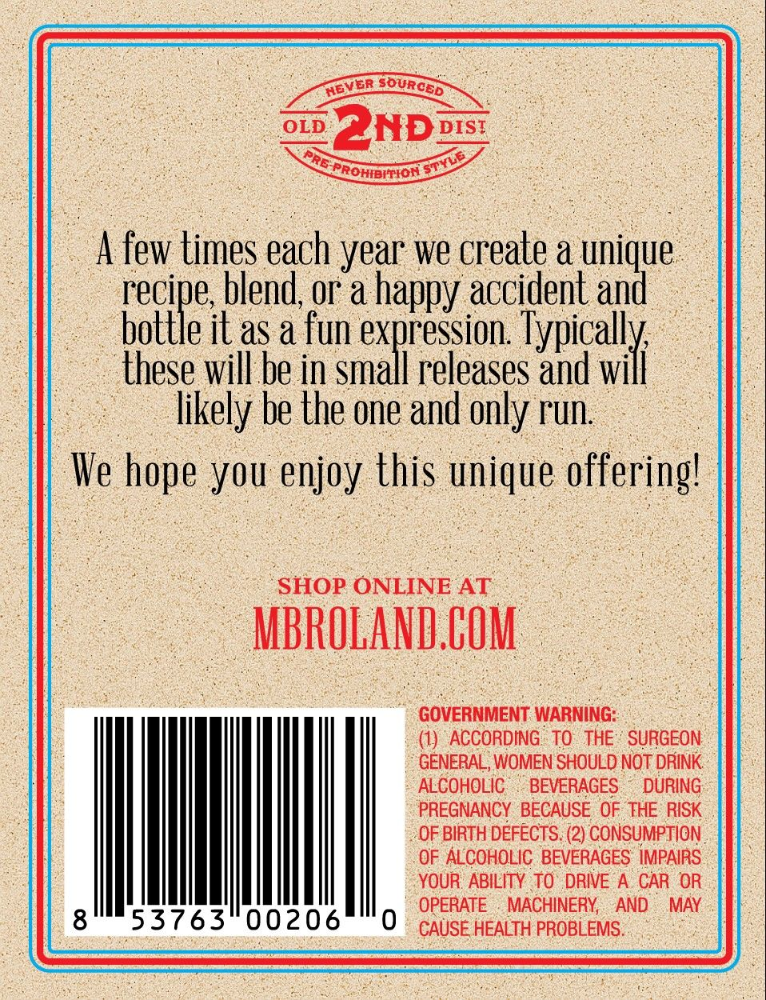
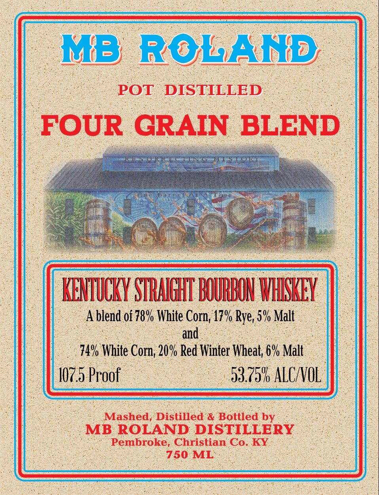

# TTB COLA Label Images - TTBID 26058001000331

**Brand Name:** MB ROLAND

**Issue Date:** 03/02/2026

**Origin Code:** 22

**Product Class/Type:** 101

**Source:** [TTB Public COLA Registry](https://ttbonline.gov/colasonline/viewColaDetails.do?action=publicFormDisplay&ttbid=26058001000331)

## Label Images

### Back Label

### Front Label

## Extracted Label Text

*Text extracted via OCR - may contain errors*

### Back Label

: 00 BND ois: a
- Seer

SROHIE RIOR =

few times a year we apa a pnigge
hole blend, or a happy accident an
~ bottle it as a fun a ioe
‘these will be in small releases and will
likely be the one and only run.

hie you enjoy this a en

( “SHOP ONLINE AT

_-MBROLAND. COM

> GOVERNMENT WARNING: aS
(1) ACCORDING TO THE’ SURGEON.
GENERAL, WOMEN SHOULD NOT DRINK.
ALCOHOLIC: . BEVERAGES DURING
PREGNANCY BECAUSE OF THE RISK
OF BIRTH DEFECTS. (2) CONSUMPTION
OF ALCOHOLIC BEVERAGES IMPAIRS
YOUR ABILITY TO DRIVE A CAR OR
OPERATE . MACHINERY, AND MAY

CAUSE HEALTH PROBLEMS...

### Front Label

ROLAND |

POT. DISTILLED _

FOUR GRAIN BLE D

KENTUCKY STRAIGHT BOURBON WHISKEY

lend 08 78% White Corn, 17

an

Nhea

O70 Ma

107.5 Proo

53. ia ALC OL

‘Mashed,’ Distilled & Bottled by

ROLAND DISTILLERY

Pembroke, Christian Co. KY.

750 ML
