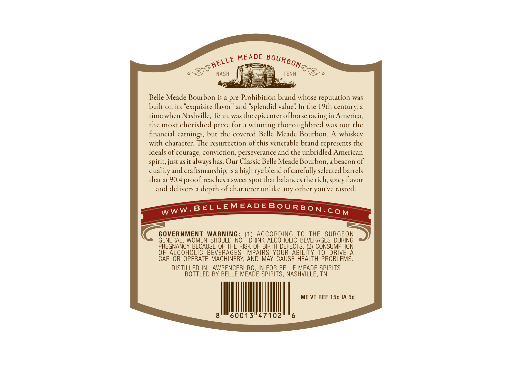
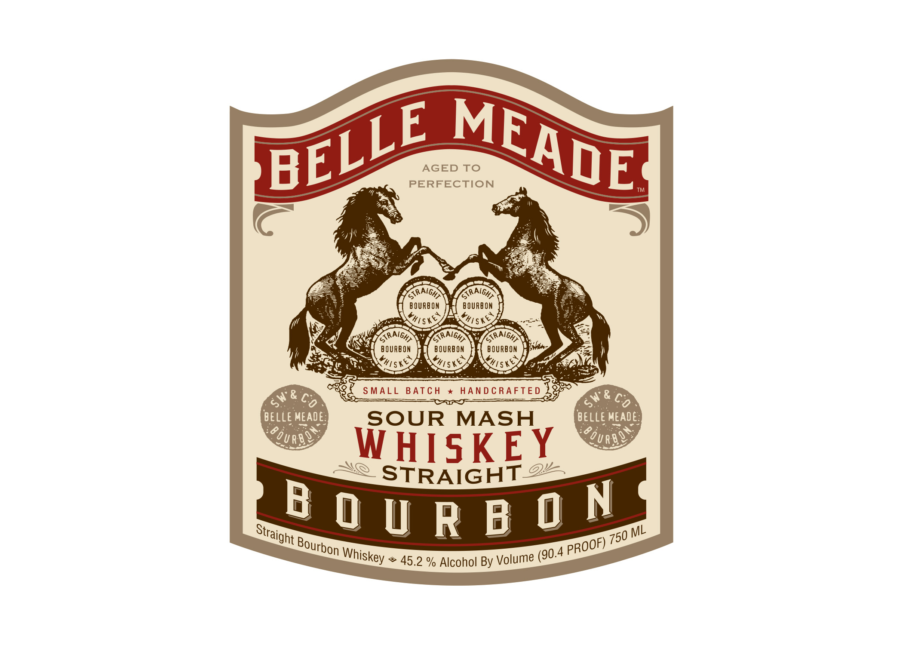

# TTB COLA Label Images - TTBID 26058001000541

**Brand Name:** BELLE MEADE BOURBON

**Issue Date:** 03/02/2026

**Origin Code:** 43

**Product Class/Type:** 101

**Source:** [TTB Public COLA Registry](https://ttbonline.gov/colasonline/viewColaDetails.do?action=publicFormDisplay&ttbid=26058001000541)

## Label Images

### Back Label

### Front Label

### Label 3

## Extracted Label Text

*Text extracted via OCR - may contain errors*

**Detected Proof:** 90.4

### Back Label

pee tm On
POs NASH (P= TENN XOnr

Belle Meade Bourbon is a pre-Prohibition brand whose reputation was
built on its “exquisite flavor” and “splendid value” In the 19th century, a
time when Nashville, Tenn. was the epicenter of horse racing in America,
the most cherished prize for a winning thoroughbred was not the
financial earnings, but the coveted Belle Meade Bourbon. A whiskey
with character. The resurrection of this venerable brand represents the
ideals of courage, conviction, perseverance and the unbridled American
spirit, just as it always has. Our Classic Belle Meade Bourbon, a beacon of
quality and craftsmanship, is a high rye blend of carefully selected barrels
that at 90.4 proof, reaches a sweet spot that balances the rich, spicy favor

and delivers a depth of character unlike any other you've tasted.

—] |_ =
Cc GOVERNMENT WARNING: (1) ACCORDING TO THE SURGEON >)

GENERAL, WOMEN SHOULD NOT DRINK ALCOHOLIC BEVERAGES DURING

PREGNANCY BECAUSE OF THE RISK OF BIRTH DEFECTS. a CONSUMPTION

OF ALCOHOLIC BEVERAGES IMPAIRS YOUR ABILITY TO DRIVE A

CAR OR OPERATE MACHINERY, AND MAY CAUSE HEALTH PROBLEMS.

DISTILLED IN LAWRENCEBURG, IN FOR BELLE MEADE SPIRITS
BOTTLED BY BELLE MEADE SPIRITS, NASHVILLE, TN
8°" 60013°47102 “6

### Front Label

pE MF

AGED TO

PERFECTION

BEL

ANF

™

\\

An.

™

Seo

GDN

BOURBON

| ouRaoy

\

(i

RY

Sis fe

oN

iy

\Ciee Wy!

iP

)\

‘aoe

cy

CRO

rey Sie)

SS eee BATCH x HANDCRAFTED

ur

& on

& CON

BELLE MEADE:

SOUR MASH

BELLE MEADE:

Oy nas,

Oy nas,

HISKE

<< STRAIGHTZ

BQ

URBO

90.4 PRO

of) 750

Straight Bourbon Whiskey

~ 45.2 % Alcohol By Volume

### Label 3

BELLE RBON
MEADE pou asnvitte
ies 34gg4NNGG
Sa AHSVN nod java
yoy qqiag
