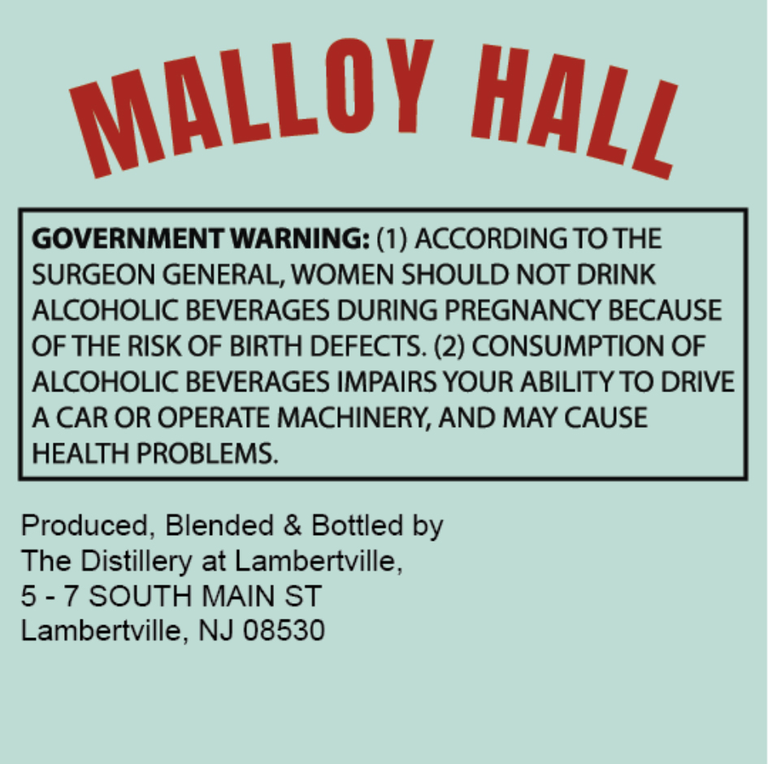
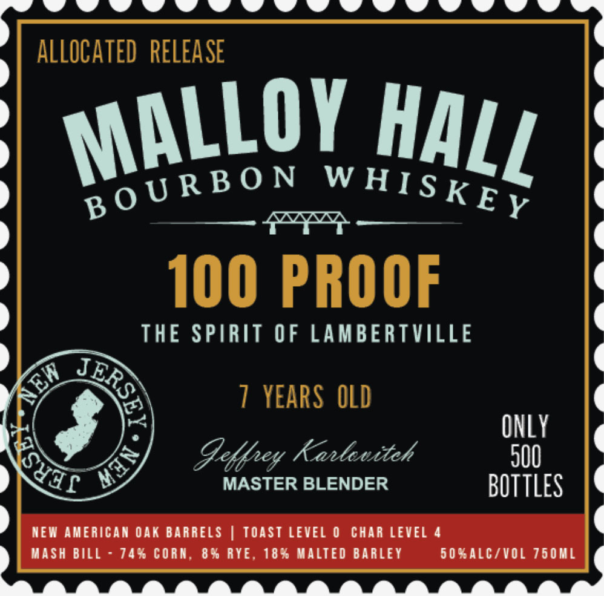

# TTB COLA Label Images - TTBID 26058001000731

**Brand Name:** MALLOY HALL BOURBON WHISKEY 100 PROOF

**Issue Date:** 03/04/2026

**Origin Code:** 03

**Product Class/Type:** 101

**Source:** [TTB Public COLA Registry](https://ttbonline.gov/colasonline/viewColaDetails.do?action=publicFormDisplay&ttbid=26058001000731)

## Label Images

### Back Label

### Label 1

## Extracted Label Text

*Text extracted via OCR - may contain errors*

**Detected Age:** 7 Years

### Back Label

GOVERNMENT WARNING: (1) ACCORDING TO THE
SURGEON GENERAL, WOMEN SHOULD NOT DRINK
ALCOHOLIC BEVERAGES DURING PREGNANCY BECAUSE
OF THE RISK OF BIRTH DEFECTS. (2) CONSUMPTION OF
ALCOHOLIC BEVERAGES IMPAIRS YOUR ABILITY TO DRIVE
A CAR OR OPERATE MACHINERY, AND MAY CAUSE
HEALTH PROBLEMS.
Produced, Blended & Bottled by
The Distillery at Lambertville,
5
7 SOUTH MAIN ST
Lambertville, NJ 08530
MALLOY
HALL

### Label 1

syssennEEn EEE

ALLOCATED RELEASE

walloy HALL

OURP Om WHISK

100 ‘PROOF

THE SPIRIT OF LAMBERTVILLE

7 YEARS OLD

SHY Karlertteh
MASTER BLENDER BOTTLES

NEW AMERICAN OAK BARRELS | TOAST LEVEL 0 CHAR LEVEL 4

MASH BILL - 74% CORN, 8% RYE, 18% MALTED BARLEY SO%ALC/VOL 750ML ¢
