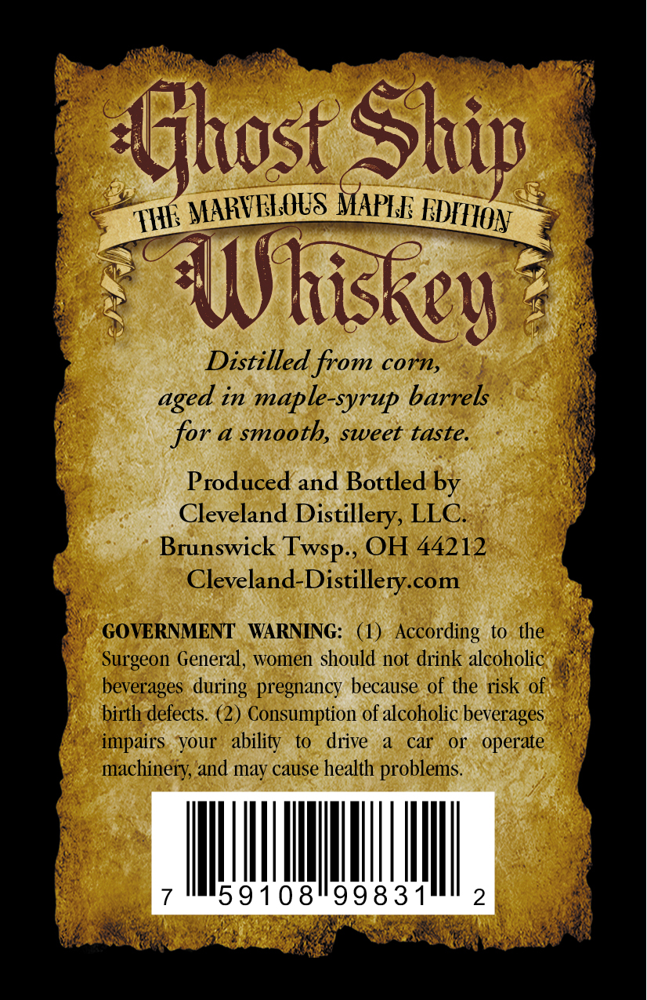
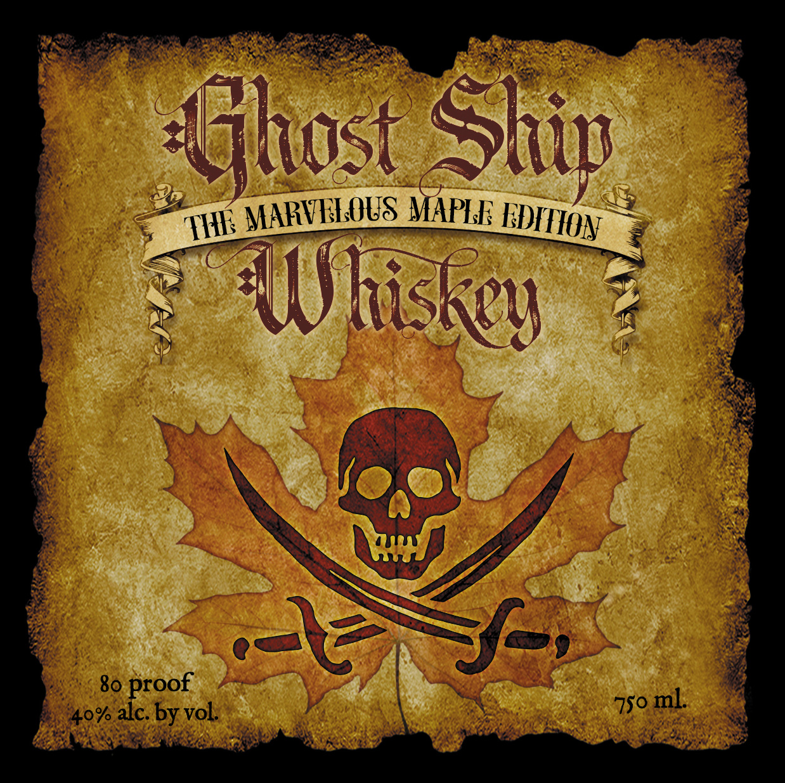

# TTB COLA Label Images - TTBID 26059001000016

**Brand Name:** GHOST SHIP WHISKEY

**Fanciful Name:** MARVELOUS MAPLE EDITION

**Issue Date:** 03/24/2026

**Origin Code:** 09

**Product Class/Type:** 140

**Source:** [TTB Public COLA Registry](https://ttbonline.gov/colasonline/viewColaDetails.do?action=publicFormDisplay&ttbid=26059001000016)

## Label Images

### Back Label

### Front Label

## Extracted Label Text

*Text extracted via OCR - may contain errors*

*1 image(s) excluded: text did not meet readability threshold*

### Back Label

Sfhost Ship
MARVELOUS MAPLF
WWliskev
Distilled from corn,
in
maple-syrup barrels
for a smooth, sweet taste.
Produced and Bottled by
Cleveland Distillery, LLC
Brunswick
OH 44212
Cleveland-Distillery.com
GOVERNMENT
WARNING:
(1)   According to the
Surgeon General,
women should not drink alcoholic
beverages
pregnancy because of the risk of
birth defects  (2) Consumption ofalcoholic beverages
impairs
your
ability
to
drive
car
or
operate
machinery; and may cause health problems
7
5910819983 1
2
FEDFIION
THF
aged
Twsp-,
during
