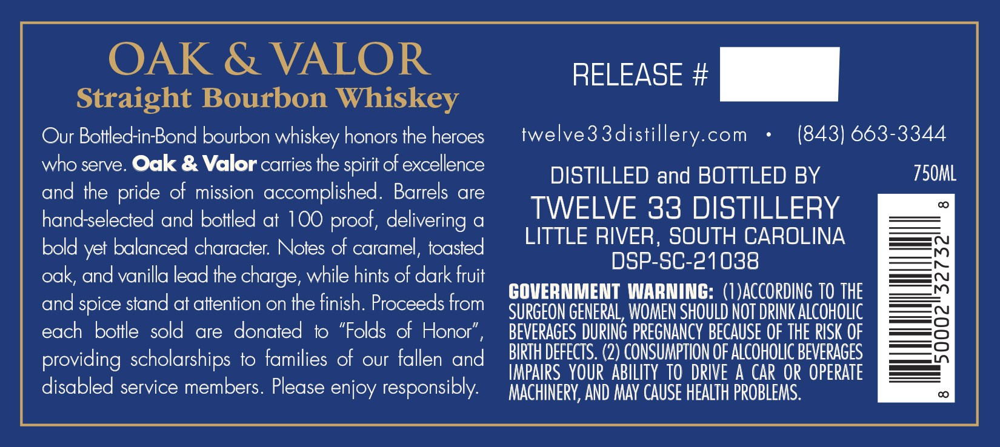
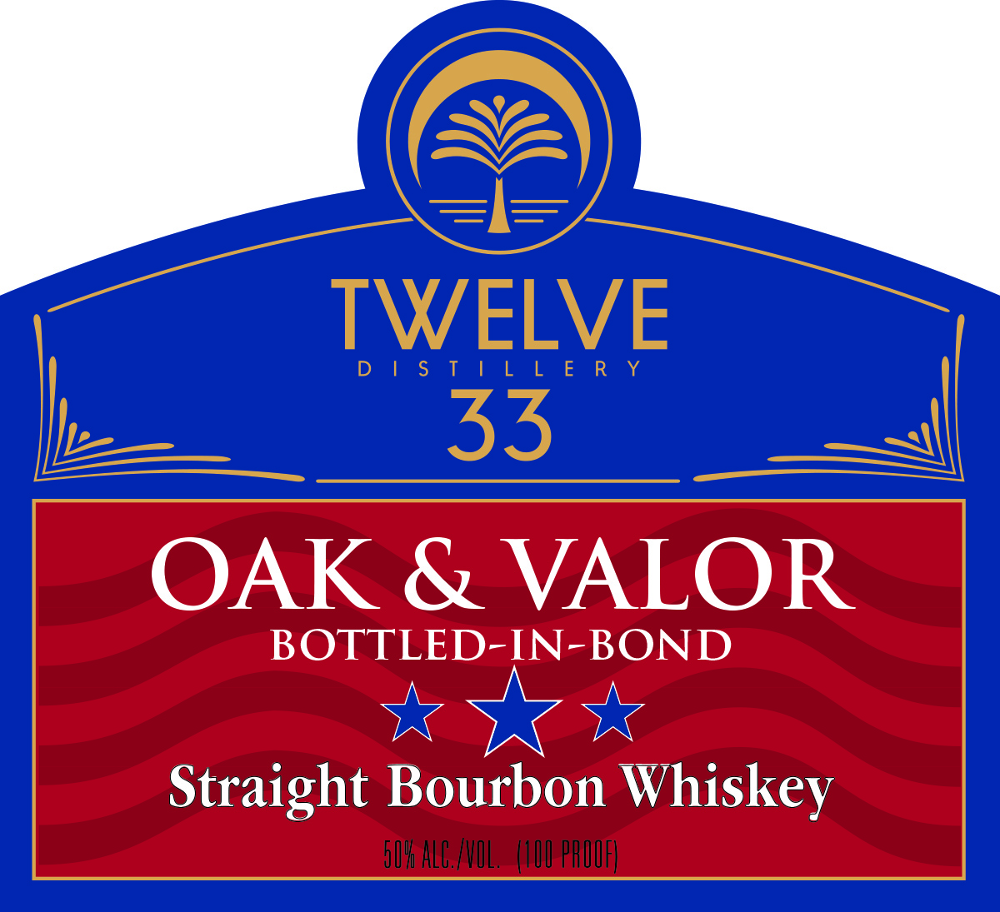
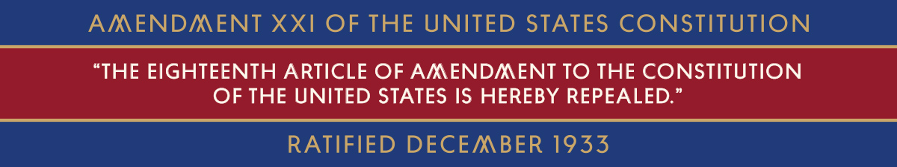

# TTB COLA Label Images - TTBID 26059001000104

**Brand Name:** TWELVE 33 DISTILLERY

**Fanciful Name:** OAK & VALOR

**Issue Date:** 03/02/2026

**Origin Code:** 41

**Product Class/Type:** 101

**Source:** [TTB Public COLA Registry](https://ttbonline.gov/colasonline/viewColaDetails.do?action=publicFormDisplay&ttbid=26059001000104)

## Label Images

### Back Label

### Front Label

### Label 3

## Extracted Label Text

*Text extracted via OCR - may contain errors*

**Detected Proof:** 100

### Back Label

OAK & VALOR
Straight Bourbon Whiskey

Our Bottled-in-Bond bourbon whiskey honors the heroes
who serve. Oak & Valor carries the spirit of excellence
and the pride of mission accomplished. Barrels are
hand-selected and bottled at 100 proof, delivering a
bold yet balanced character. Notes of caramel, toasted
oak, and vanilla lead the charge, while hints of dark fruit
and spice stand at attention on the finish. Proceeds from
each bottle sold are donated to “Folds of Honor”,

providing scholarships to families of our fallen and
disabled service members. Please enjoy responsibly.

RELEASE +

twelve33distillery.com + (843) 663-3344

DISTILLED and BOTTLED BY

TWELVE 33 DISTILLERY
LITTLE RIVER, SOUTH CAROLINA
DSP-SC-21038

GOVERNMENT WARNING: (1)ACCORDING 10 THE
SURGEON GENERAL, WOMEN SHOULD NOT DRINK ALCOHOLIC
BEVERAGES DURING PREGNANCY BECAUSE OF THE RISK OF
BIRTH DEFECTS. (2) CONSUMPTION OF ALCOHOLIC BEVERAGES
IMPAIRS YOUR ABILITY TO DRIVE A CAR OR OPERATE
MACHINERY, AND MAY CAUSE HEALTH PROBLEMS.

750ML

MM

aN 32732

8

### Front Label

=
33
ante
tye ie
Straight Bourbon Whiskey

### Label 3

AMENDMENT XXI OF THE UNITED STATES CONSTITUTION

“THE EIGHTEENTH ARTICLE OF AMENDMENT TO THE CONSTITUTION

OF THE UNITED STATES IS HEREBY REPEALED.”

RATIFIED DECEMBER 1933
