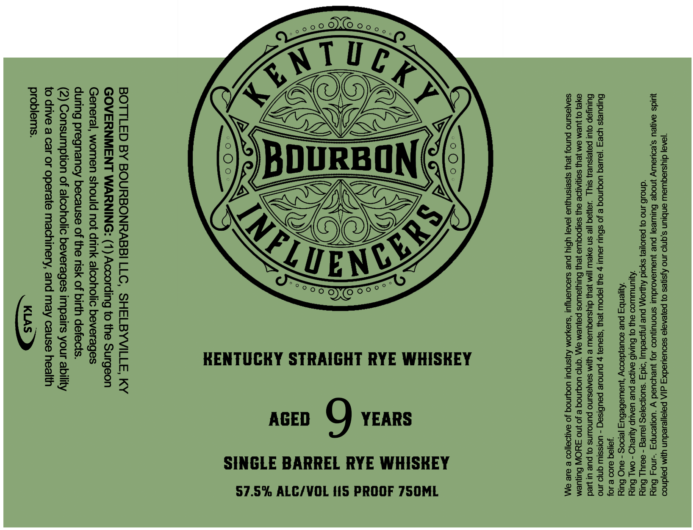

# TTB COLA Label Images - TTBID 26059001000121

**Brand Name:** INFLUENCERS

**Issue Date:** 03/05/2026

**Origin Code:** 22

**Product Class/Type:** 102

**Source:** [TTB Public COLA Registry](https://ttbonline.gov/colasonline/viewColaDetails.do?action=publicFormDisplay&ttbid=26059001000121)

## Label Images

### Label 1

## Extracted Label Text

*Text extracted via OCR - may contain errors*

**Detected Proof:** 115

### Label 1

‘J@AQ| diysuaquiaw anbiun s.qnjo uno Ajsqes 0} payengja saouauedx  qI/\ paja|/esedun ym pajdnoo

quids aageu s,eouewly jnoge Gules} pue juewWarciduul snonuqUOd Jo} JUeyoUad Y “UOneONpy ~4no4 Bury
“dnou6 ino 0} payoye} syoid Ayony pue jnjoeduy) ‘o1d3 “suoqoajas jaueg - se1y| Bury

“Ayunwiwi0o ayy 0} Buiai6 aagoe pue uaaup Aweyd - omy Bury

“Ayjenby pue souejdscoy ‘uswebebuz je0s - auC Bury

‘yoll9q 8109 e JO}

Bulpuejs yes ‘javeq uoginog e Jo shuy Jouu! 7 ay |ePOW Jey} ‘s}aUa} 7 punoue paubisaq - UOISsIW gnjo JNO
Buruyap oyu! payejsuey} siyj Jayjaq |}e sn eye |M Jeu} diyssequiaw e UM Sanjesuno punoUNs oO} pue ul Wed
YE} 0} ]UEM aM JEU} SANIANOE OU} SaIpOquia yey) BulyJaWOs payUeM a “gnjd UOGINOg e Jo NO FYOIW Sunuem
S@AJOSINO PUNO} JEU} s}seisnyjUA JeA9] YBIYy pue siedUeNyu! ‘sioy10M ANSNPU! UOGINOg Jo aANDaIICO & ale a\\

AGED QO YEARS
SINGLE BARREL RYE WHISKEY
57.5% ALC/VOL t!S PROOF 7SOML

al
ta
- =|
Ee
=
=
=
[--|
a
- =|
ee
<x
[- -|
| aand
a
al
- =|
o
=
=
=
tad
- =|

BOTTLED BY BOURBONRABBI LLC, SHELBYVILLE, KY
GOVERNMENT WARNING: (1) According to the Surgeon
General, women should not drink alcoholic beverages
during pregnancy because of the risk of birth defects.

(2) Consumption of alcoholic beverages impairs your ability
to drive a car or operate machinery, and may cause health

problems. KLAS
